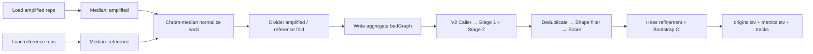
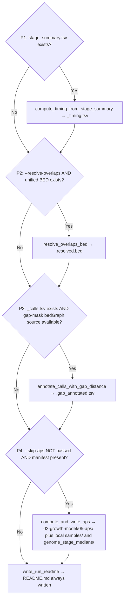

```mermaid
flowchart LR
    A[Load replicates] --> B{One stage or two?}
    B -->|Option A: one stage| C[Median across reps]
    B -->|Option B: two stages| D[Median amplified + median reference]
    C --> E[Chrom-median normalize → fold]
    D --> F[Chrom-median normalize each → ratio fold]
    E --> G[Subset chromosomes]
    F --> G
    G --> H[Write aggregate bedGraph]
    H --> I[V2 Caller: Stage 1 mean-shift scan]
    I --> J[Stage 2: Refine + fit triangle/block]
    J --> K[Write _single_calls.tsv]
    K --> L[Deduplicate by locus]
    L --> M[Shape filter: dBIC_flat_vs_tri]
    M --> N[Score: logBF + BED score + amplicon IDs]
    N --> O[Write base summit BED + domains BED]
    O --> P[Extract summit heights from base fold]
    P --> Q{Hires manifests?}
    Q -->|Yes| R[Hires fold tracks + stage2 peak refinement]
    Q -->|No| S{Bootstrap origins?}
    R --> S
    S -->|Yes| T[Resample replicates → refine peaks × N_boot]
    S -->|No| U[Assemble origins.tsv + metrics.tsv]
    T --> U
    U --> V[Write final summit BED + summary bedGraphs]
```

# Onionskin Pipeline Specification

**Last updated:** 2026-04-10
**Corresponds to:** Phase 9 (with legacy Phase 5 core sections retained)

This document translates every pipeline in onionskin into plain English and mathematics, step by step, as the code executes.  It is intended for human developers and AI agents alike and should be kept in sync with the code.

> **Maintenance rule:** Any time `CHANGELOG.md` is updated, check whether it merits updating this document.  Before making any changes, produce an update plan and report it back to the user for approval.

---

## Phase 7 Addendum (Current Behavioral Overrides)

This document still contains detailed Phase 5 core pipeline math below. The
following addendum records current Phase 7 behavior that supersedes any older
wording elsewhere in this file.

### A. Pipeline selection policy (`--pipelines`)

- Available pipeline names: `growth`, `rms`, `hmm`.
- `--pipelines all` means: `growth + rms + hmm`.
- HMM is intentionally opt-in and runs only when `--pipelines` includes `hmm` directly or via `all`.
- There are no separate run/skip HMM CLI flags in current policy.

### A.1 Pipeline-specific normalization defaults

- `--growth-norm-mode`, `--rms-norm-mode`, and `--hmm-norm-mode` are pipeline-specific overrides.
- `inherit` means "follow the shared global `--norm-mode`"; it is an explicit compatibility override, not the whole default policy by itself.
- If one of these flags is left unset, onionskin applies the pipeline-specific runtime default rather than treating the missing flag as `inherit`.
- Current default behavior:
    - growth defaults to `chrom-median`
    - HMM defaults to `chrom-median`; use `--hmm-norm-mode ref-stage` for legacy reference-stage behavior
    - rcn-mean-shift defaults to `chrom-median` for 1 stage, `ref-stage` only for two-stage reference-backed inputs, and on 3+ stage inputs follows the shared global `--norm-mode` unless explicitly overridden

### A.2 APS normalization surfaces

- The main onionskin APS pass is triggered from `onionskin.py` `_phase2_postprocess()` and uses the resolved normalization/reference-stage contract of the active growth or rcn-mean-shift lane.
- HMM step-16 APS is currently a separate product path. It is driven from `onionskin_core/engines/hmm_engine.py` into `onionskin_core/hmm_ported_analyses.py` and uses the resolved HMM normalization/reference-stage contract for that lane.
- `--norm-mode` therefore acts as the shared global normalization control and fallback for pipeline-specific runtime defaults, but it is not yet a single final APS knob across every APS-producing surface in the codebase.

### A.3 Forced manifest remap

- By default, manifest-backed runs still require canonical stage numbering: distinct stages must already be labeled `1..N` in developmental order.
- `--force-manifest` is an explicit compatibility path for non-canonical user manifests. It remaps the user's stage labels onto onionskin's runtime `1..N` contract before controller dispatch and writes the canonical runtime manifest to `01-prior/00-synthetic-manifest.tsv`.
- Forced-manifest runs also emit a stage translation sidecar `01-prior/00-stage-translation.tsv` with columns `original_stage` and `canonical_stage`.
- When hires manifests are provided, onionskin applies the same forced-remap workflow to them too, but only after confirming that the raw hires manifests already contain the same samples in the same order as the primary manifest and encode the same sample-to-group assignment pattern. Matching filenames by basename are required row by row; directory differences by resolution are expected.
- Forced-remap hires outputs are written visibly alongside the primary synthetic manifest as `01-prior/00-synthetic-hires-manifest_{i}.tsv` and `01-prior/00-stage-translation.hires_{i}.tsv`.
- Once written, the synthetic manifest is treated exactly like any other canonical runtime manifest. Posterior regrouping therefore works unchanged from that point onward.

### B. HMM pipeline status

- HMM integration is native by default and runs as a 19-step pipeline under
    grouped `01-hmm/` inside the active grouping directory (`01-prior/01-hmm/`
    for prior runs, `02-posterior/01-hmm/` for posterior regrouping):
    1. `01-mednorm`
    2. `02-stage-medians`
    3. `03-removeZeroBins`
    4. `04-chrom-renorm`
    5. `05-medianSmoothed-RCN`
    6. `06-HMM`
    7. `07-collapsedHMM`
    8. `08-aboveBackground`
    9. `09-summitStates`
    10. `10-summitBins`
    11. `11-amplicon-metrics`
    12. `12-fork-travel`
    13. `13-summit-refinement`
    14. `14-multistage-unification`
    15. `15-gap-analysis`
    16. `16-aps`
    17. `17-saps`
    18. `18-timing`
    19. `19-clustering`

- Current step-12 outputs include:
    - `12-fork-travel/fork_travel_metrics.tsv`
    - `12-fork-travel/fork_age_metrics.tsv`
    - `12-fork-travel/width_progression_metrics.tsv`
    - `12-fork-travel/plots/*.png` including fork-travel, fork-age, asymmetry,
      heatmap, and nested-domain visualizations

- Current HMM notebook outputs include:
    - `01-prior/01-hmm/notebooks/fork_travel_explorer.ipynb`
    - `01-prior/01-hmm/notebooks/hmm_state_path_qc.ipynb`
    - `01-prior/01-hmm/notebooks/amplicon_atlas.ipynb`
    - `01-prior/01-hmm/notebooks/parameter_characterization.ipynb`

- Runtime entry point:
    - `onionskin.py` -> `_run_hmm_engine()`
    - `onionskin_core/engines/hmm_engine.py` -> `run_hmm()`

### C. Step-6 backend fallback policy

- Native step-6 backend is default.
- Debug/rollback fallback remains env-only:
    - `ONIONSKIN_HMM_STEP6_BACKEND=native|puffstep`
- This backend switch is not a standard user-facing tuning knob.

### D. Validation guardrails (Phase 7 parity discipline)

- Regression guard for HMM output parity:
    - `make puff-compare`
- Current expected baseline:
    - `OVERALL: PASS (28 files match)`

---

---

## How to Read This Document

- Each pipeline is described as numbered steps (1, 2, 3, …).
- When a step has multiple options depending on inputs or parameters, they are labelled *Option A*, *Option B*, etc.  Steps that depend on which option was taken are annotated accordingly.
- Each step describes: **Aim**, **Inputs**, **What happens (plain English + math)**, **Outputs / files written**.
- Math is given in LaTeX-rendered Markdown (`$$ … $$`).
- High-level flowcharts appear twice: once in the top **Briefing** section, once at the start of each pipeline section.

---

# Part 0 — Briefing: All Pipelines at a Glance

## Mode Selection

The mode is chosen automatically from the inputs by `autodetect.decide_mode()`:

```
Inputs                                         Mode selected
─────────────────────────────────────────────  ─────────────────────────
--onionskin file.bg   (1 file, no ref)      →  Pipeline 1: Single-file
--onionskin f1.bg,f2.bg  (multiple files)   →  Pipeline 2A: Single-stage
--onionskin f1.bg + --reference r1.bg       →  Pipeline 2B: Ratio-of-ratios
manifest with 1 stage + N replicates        →  Pipeline 2A: Single-stage
manifest with 2 stages (or --reference)     →  Pipeline 2B: Ratio-of-ratios
manifest with ≥3 stages                     →  Pipeline 3: Multistage
```

Specifically:
- **Single-file** mode: `--onionskin` receives exactly one file path with no manifest and no reference.
- **Single-stage** mode: `--onionskin` receives a comma-separated list of two or more files (treated as replicates at one stage), **or** a manifest is provided with exactly 1 unique stage.
- **Ratio-of-ratios** mode: manifest with exactly 2 unique stages, or `--onionskin` + `--reference`.
- **Multistage** mode: manifest with 3 or more unique stages.
- **HMM mode** is not selected by `autodetect.decide_mode()`. It runs only when `--pipelines` includes `hmm` directly or via `all`. When `--manifest` is absent but HMM is requested from the `--onionskin` / `--reference` code path, onionskin synthesizes a temporary manifest in the shared manifest format for HMM-only helper stages.

## Pipeline capability matrix

Which pipelines are eligible for a given input contract:

| Input contract | Stages | Has ref stage | Eligible pipelines |
|---|---|---|---|
| Single-file | 1 (1 sample) | N/A | `rcn-mean-shift`, `hmm` |
| Single-stage | 1 (>=2 replicates) | N/A | `rcn-mean-shift`, `hmm` |
| Two-stage, ref-backed | 2 | yes | `rcn-mean-shift`, `hmm` |
| Two-stage, no ref | 2 | no | `growth`, `rcn-mean-shift`, `hmm` |
| Multistage | >=3 | any | `growth`, `rcn-mean-shift`, `hmm` |

`growth` requires >=3 stages, or 2 stages without a ref-stage contract, for stable parabola
fitting. `rcn-mean-shift` and `hmm` work with any single-stage or multistage input. Source of truth:
`onionskin_core/autodetect.py::decide_mode()`.

Pipelines 2A and 2B share the same code path from the caller onward; the ratio-of-ratios branch is selected *internally* inside `_single_stage_fold_track()` when two stages are present.  3+ unique stages → `multistage`.

**Implementation note:** When `--onionskin` is used (without `--manifest`), mode dispatch is handled inline in `main()` based on the number of files and the presence of `--reference` — `autodetect.decide_mode()` is **not** called.  `decide_mode()` is only invoked for the `--manifest` code path, and it returns `"single-stage"` for both 1-stage and 2-stage manifest inputs (ratio-of-ratios is an internal sub-branch, not a separate mode string).

**Stability warnings** are issued at runtime (exact strings from `autodetect.py`):
- 3 stages: "STRONG WARNING: Only 3 stages detected. Multistage modeling can be unstable; consider single-stage (case/control) if appropriate."
- 4 stages: "WARNING: Only 4 stages detected. Multistage modeling is supported, but onset/width trends may be less stable than with 5+ stages."
- ≥5 stages: no warning.

**Where the code lives:**
- `onionskin.py` → `main()` — top-level entry point; builds sample list, calls `autodetect.decide_mode()`, then dispatches to the appropriate pipeline
- `onionskin_core/autodetect.py` → `decide_mode()` — determines which mode to run
- `onionskin_core/io.py` → `read_manifest()`, `parse_csv_list()`, `Sample` dataclass — manifest parsing and sample object construction

---

## How to Read the Flowcharts

The following sections each contain a Mermaid flowchart.  Here are the conventions used throughout.

**Node syntax:**

```
A[Descriptive label]     — rectangular process node
A{Decision?}             — diamond decision node
A                        — bare ID: if A has already been given a label, reuses it; otherwise displays "A"
```

**Edge syntax:**

```
A --> B                  — arrow from A to B (no label)
A -->|Yes| B             — arrow with label "Yes"
A -->|No| B              — arrow with label "No"
```

**Label placement rule:** A node's display label is set on its **first occurrence** with brackets.  All subsequent references to the same ID (with or without brackets) resolve to the same node.  All flowcharts in this document follow this convention — if you see a node ID referenced without brackets, its label was defined earlier in the same diagram.

**Multi-source convergence ("fan-in") pattern:**

A common pattern in this document is two independent upstream chains that both feed the same downstream node:

```
A --> B
C --> D
B --> E[Shared next step]
D --> E
```

This is **valid Mermaid graph construction** — it is not an error.  It means "regardless of which upstream path was taken (A→B or C→D), both converge at E."  Mermaid processes each edge statement independently; a node does not need to appear before it is referenced as a target.  Reading tip: trace backwards from E to find all routes that lead into it.

**Decision nodes and skipped steps:**

Decision diamonds have `|Yes|` and `|No|` branches.  When a `|No|` branch jumps past intermediate nodes directly to a later step, the diagram is showing that the step is conditional and is simply skipped on the `No` path — the pipeline continues at the indicated downstream node.

---

## Pipeline 1 — Single-file (overview)


---

## Pipeline 2A — Single-stage (overview)

```mermaid
flowchart LR
    A[Load replicates] --> B[Median across reps]
    B --> C[Chrom-median normalize → fold track]
    C --> D[Write aggregate bedGraph]
    D --> E[V2 Caller: Stage 1 mean-shift]
    E --> F[Stage 2: Refine + fit]
    F --> G[Write _single_calls.tsv]
    G --> H[Deduplicate calls]
    H --> I[Shape filter: dBIC_flat_vs_tri]
    I --> J[Score: logBF + BED score]
    J --> K{Hires manifest?}
    K -->|Yes| L[Hires refinement loop]
    K -->|No| M[Bootstrap summit CI]
    L --> M
    M --> N[Assemble origins.tsv + metrics.tsv]
    N --> O[Write summary tracks + final summit BED]
```



---

## Pipeline 2B — Ratio-of-ratios (overview)



*Pipelines 2A and 2B share all steps from "V2 Caller" onward.  The only difference is how the fold track is built in Steps 1–3.*

---

## Pipeline 3 — Multistage (overview)


---

## Pipeline 4 — HMM State-Path (overview)


*Unlike Pipelines 1–3, this pipeline is not auto-selected by mode detection. It runs only when `--pipelines` includes `hmm` directly or via `all`. In manifest-free `--onionskin` / `--reference` controller paths, onionskin synthesizes a temporary manifest before dispatching HMM.*

---

## Phase 2 — Post-processing (shared, conditional)



> **Exception handling note:** Steps P1, P2, and P3 share a single `try/except` block in `onionskin.py`.  If any of these steps raises an unhandled exception, all subsequent steps within the same block are silently skipped (a warning is printed to stderr).  Steps P4 (APS), profile plots, shape filter plots, summit plots, QC plots, notebook generation, amplicon recommendation finalization, and README generation each have their own independent `try/except` blocks.  A failure in any one block does not prevent any other block from running.

---

---

# Pipeline 1 — Single-file Mode

One bedGraph, no reference.  Calls `run_singlefile_caller` then `apply_shape_filter_tsv`.

### Flowchart


---

### Step 1 — Read bedGraph and detect bin size

**Aim:** Load the input bedGraph and determine the genomic bin size.

**Inputs:** `--onionskin file.bedGraph`

**What happens:**
The file is read into a 4-column table (chrom, start, end, value). The bin size is inferred as the **mode** of individual bin widths ($\text{end}_i - \text{start}_i$), sampled across the file.

$$b = \text{mode}(\{end_i - start_i\})$$

**Output:** A table of (chrom, start, end, value) and $b$ (bin size in bp).

**Where the code lives:**
- For Pipeline 1 (single-file mode): `onionskin_core/engines/single_engine.py` → `read_bedgraph()`, `detect_bin_size()`
- For Pipelines 2+ (single-stage and multistage modes): `onionskin_core/refinement.py` → `read_bedgraph()`, `detect_bin_size()` (imported into and used by `single_engine.py` and `multistage_engine.py`)
- `onionskin_core/binning.py` → `detect_major_bin_size()`, `_detect_major_bin_size_from_path()`

---

### Step 2 — Chromosome-median normalization → RCN and log₂RCN

**Aim:** Remove between-chromosome copy-number differences and put all values on a relative scale.

**What happens:**
For each chromosome $c$, compute the median of **positive-valued bins only** (bins with value $\leq 0$ are excluded from the median calculation):

$$M_c = \text{median}(\{v_i : \text{chrom}_i = c,\; v_i > 0\})$$

Divide every bin on that chromosome by its chromosome median:

$$\text{RCN}_i = \frac{v_i}{M_c}$$

Then compute the log₂ transform:

$$\text{log2RCN}_i = \log_2(\text{RCN}_i)$$

Bins with $v_i \leq 0$ are set to NaN after normalization.  If $M_c$ itself is ≤0 or non-finite (e.g., a chromosome consisting entirely of zero bins), all bins on that chromosome are set to 0.

**Output:** The table gains `norm` (RCN) and `log2` (log₂RCN) columns.

**Where the code lives:**
- For Pipeline 1 (single-file mode): `onionskin_core/engines/single_engine.py` → `per_chrom_median()`, `add_norm_log2()`
- For Pipelines 2+ (single-stage and multistage modes): `onionskin_core/refinement.py` → `per_chrom_median()`, `add_norm_log2()` (imported into and used by `single_engine.py` and `multistage_engine.py`)

---

### Step 3 — Stage 1: Mean-shift scan (candidate detection)

**Aim:** Find genomic regions where the log₂RCN signal is elevated above local background at one or more detection scales.

**Inputs:** `log2` column; parameters: `--rms-halfwidths` (default `40,80,120,160,220,300`), `--rms-trend` (default 2000), `--rms-z-thresh` (default 2.5), chromosome list.

**Unified-summit selector note for stage-structured rcn-mean-shift:** multistage `rcn-mean-shift` now shares the curated 68-ID summit strategy menu with Growth and HMM. Use `--summit-stage-selection` for a universal opt-in override or `--rms-summit-stage-selection` for an RMS-only override. When omitted, RMS keeps its current canonical unified-peak behavior; when set, the chosen strategy replaces the summit consumed by timing and APS. `--early-summit-stages` and `--early-summit-n-stages` parameterize the `early-N-non-ref` and `odw-first-N` strategy families. Legacy `--rms-early-summit-stages` and `--rcn-early-summit-stages` remain deprecated aliases to the universal `--early-summit-stages` knob.

**Note on RMS defaults:** The wrapper (`onionskin.py`) and the shared RMS engine entry points (`run_per_stage_mean_shift()` / `run_rcn_mean_shift()`) are aligned to the same live calibrated detection pair: halfwidths `40,80,120,160,220,300` and z-thresh `2.5`.

**What happens:**

For each chromosome independently:

**3a. Compute local baseline (rolling median):**

$$\text{baseline}_i = \text{rolling\_median}(y, w_\text{trend})$$

where $w_\text{trend} = \lfloor \text{trend\_kb} \times 1000 / b \rfloor$ bins (default ≈ 400 bins at 5 kb/bin).

**3b. Compute residual:**

$$r_i = y_i - \text{baseline}_i$$

**3c. For each halfwidth $h$ (in bins):**

Convolve residual with a boxcar kernel of half-width $h$:

$$s_i = \frac{1}{2h+1} \sum_{j=i-h}^{i+h} r_j$$

Compute robust z-score:

$$\sigma = 1.4826 \cdot \text{MAD}(s)$$

If $\sigma = 0$, fall back to $\sigma = \text{std}(s)$.  If the result is still zero or non-finite, use $\sigma = \text{std}(s) + 10^{-9}$.

$$z_i = \frac{s_i - \tilde{s}}{\sigma}$$

where $\tilde{s}$ is the median.

Find local maxima of $z$ with minimum separation $h$ bins.  Each maximum with $z_i \geq z_\text{thresh}$ becomes a **candidate**, with boundaries expanded outward from the peak until the residual drops below $\varepsilon = 0.005$.

**3d. Merge candidates:** overlapping candidates are merged into a single interval spanning the **union** of both candidates' boundaries, keeping the peak position and scale of the highest-scoring candidate.

**Output:** A list of candidate amplicons with (chrom, start, peak, end, stage1\_score\_z, stage1\_scale\_bins).

**Where the code lives:**
- `onionskin_core/detection.py` → `stage1_mean_shift()`
- `onionskin_core/signal_utils.py` → `rolling_median()`, `robust_z()`, `conv1d()`, `boxcar_kernel()`, `find_local_maxima()`
- `onionskin_core/engines/single_engine.py` → `main()` supplies the direct-engine defaults and invokes the stage-1 scan

---

### Step 4 — Stage 2: Boundary refinement and shape fitting

**Aim:** For each candidate, refine the precise start/end/peak coordinates and fit triangle and block models to assess shape.

**Inputs:** Candidates from Step 3; parameters: `--rms-peak-search-halfwidth` (250), `--rms-scan-halfwidth` (700), `--rms-trend`, `--rms-smooth` (80).

**What happens (per candidate):**

**4a. Extract analysis window:**
A window of ±window\_kb around the candidate center is extracted from the log₂ signal.

**4b. Compute smoothed residual in window:**

$$r_i = y_i - \text{rolling\_median}(y, w_\text{trend})$$
$$rs_i = \text{smooth\_mean}(r, w_\text{smooth})$$

*(In the code this is `smooth_mean()`, a uniform-window running mean.)*

**4c. Find refined peak:**
Search within ±peak\_search\_kb of the candidate peak for the maximum of $rs$.

**4d. Find refined start/end:**
Expand left/right from the refined peak until $rs$ drops below $\varepsilon = 0.01$, then add a 100 kb padding buffer (rounded down to the nearest whole number of bins: $\lfloor 100{,}000 / b \rfloor$).

**4e. Fit triangle model (bump):**
Build a triangular basis function that linearly ramps from 0 at `start` to 1 at `peak`, then back to 0 at `end`:

$$\phi_i = \begin{cases} \frac{i - \text{idx\_s}}{\text{idx\_p} - \text{idx\_s}} & \text{idx\_s} \leq i \leq \text{idx\_p} \\ \frac{\text{idx\_e} - i}{\text{idx\_e} - \text{idx\_p}} & \text{idx\_p} < i \leq \text{idx\_e} \\ 0 & \text{otherwise} \end{cases}$$

Fit by least squares (with intercept $b$ and height $h$):

$$\hat{y}_i = b + h \cdot \phi_i$$

$$\text{SSE}_\text{bump} = \sum_i (y_i - \hat{y}_i)^2, \quad k_\text{bump} = 2$$

**4f. Fit block model (rectangle):**
Compute the mean of bins inside and outside [start, end]:

$$b = \overline{y}_\text{outside}, \quad h = \overline{y}_\text{inside} - b$$

$$\hat{y}_i = \begin{cases} b + h & \text{start} \leq i \leq \text{end} \\ b & \text{otherwise} \end{cases}$$

$$\text{SSE}_\text{block} = \sum_i (y_i - \hat{y}_i)^2, \quad k_\text{block} = 2$$

**4g. Compute BIC and delta-BIC:**

$$\text{BIC}(m) = n \ln\!\left(\frac{\text{SSE}_m}{n}\right) + k_m \ln(n)$$

$$\Delta\text{BIC}_\text{block-bump} = \text{BIC}_\text{block} - \text{BIC}_\text{bump}$$

A **positive** value favors the bump (gradient) model over the block.

**4h. Compute blockiness metrics** (on smoothed residual $rs$ in [start, end]):
- $\text{flat\_prop}$ = fraction of interior consecutive differences with $|d| < 0.001$
- $\text{mean\_abs\_slope}$ = mean of $|d_i|$ in interior 20–80% of segment
- $\text{peak\_frac\_0.9}$ = fraction of segment $\geq 0.9 \times \max(rs)$

**Output per candidate:**

| Column | Meaning |
|--------|---------|
| `start`, `peak`, `end` | Refined genomic coordinates (bp) |
| `width_bp` | end − start |
| `peak_log2_above_local` | $h$ from bump fit (log₂ units above local baseline) |
| `peak_fold_above_local` | $2^h$ |
| `delta_BIC_block_minus_bump` | $\Delta\text{BIC}$ (positive = gradient-shaped) |
| `block_h` | $h$ from block fit |
| `flat_prop`, `mean_abs_slope`, `peak_frac_0.9` | Blockiness metrics |

**Where the code lives:**
- `onionskin_core/refinement.py` → `stage2_score()`, `boundaries_and_peak()`, `blockiness_metrics()`
- `onionskin_core/detection.py` → `fit_bump_triangle_basis()`, `fit_block()`
- `onionskin_core/signal_utils.py` → `bic()`

---

### Step 5 — Write `_single_calls.tsv`

**Aim:** Persist detection results to disk.

The TSV contains all columns from Steps 3–4 plus `stage1_score_z` and `stage1_scale_bins`.

**Files written:** `{out_prefix}_single_calls.tsv`

**Where the code lives:**
- `onionskin_core/engines/single_engine.py` → `main()` — writes the TSV at the end of the caller
- Entry point from `onionskin.py` via `onionskin_core/detection.py` → `run_singlefile_caller()`

---

### Step 6 — Shape filter: `dBIC_flat_vs_tri`

**Aim:** Remove calls that are constitutional/collapsed-repeat elevations rather than genuine gradient amplicons.

**Inputs:** `_single_calls.tsv`, the input bedGraph, `--shape-score-threshold` (default 50).

**What happens:**

For each call, extract a segment of raw log₂ signal (with ±100 bin context), using the **chromosome-wide median** as a fixed baseline $\mu_c$:

$$\tilde{y}_i = \log_2(v_i + 0.01)$$

Build the same triangle basis $\phi$ as Step 4e (using the call's start/peak/end coordinates).  Subtract the fixed baseline:

$$y^c_i = \tilde{y}_i - \mu_c$$

Fit height by least squares (baseline already fixed, so $k=1$):

$$h = \frac{\sum_i y^c_i \phi_i}{\sum_i \phi_i^2}$$

Compute SSE for the triangle and flat models:

$$\text{SSE}_\text{tri} = \sum_i (y^c_i - h \phi_i)^2, \quad \text{SSE}_\text{flat} = \sum_i (y^c_i)^2$$

Compute BIC.  **Default mode** (`--shape-score-strict-bic` omitted or `off`): $k = 1$ for both models; the penalty term $k \ln n$ is identical and cancels, making the score a pure log-ratio of SSEs (equivalent to a likelihood-ratio test):

$$\text{dBIC\_flat\_vs\_tri} = \text{BIC}_\text{flat} - \text{BIC}_\text{tri}$$

**`--shape-score-strict-bic on` mode**: $k = 0$ for the flat model (baseline is fixed externally — no free parameters) and $k = 1$ for the triangle model.  Each call's score is reduced by $\ln(n_\text{bins})$, where $n_\text{bins}$ is the number of finite signal bins spanning that call (e.g., $\approx 4.6$ for a 500 kb call at 5 kb bins, $\approx 6.0$ for a 2 Mb call).  The threshold 50 was calibrated against default mode; re-calibration is needed before using strict mode in production.  Testing on DS2 chr II showed no calls change status at threshold 50 — real amplicons score 230+ points above threshold.

**Interpretation:**
- **Near zero / negative:** the region is a flat plateau above the chromosome median — likely a constitutional elevation or collapsed repeat.  **Filtered out.**
- **Large positive (≥ 50):** the triangle model substantially outperforms flat — the signal has genuine gradient structure rising to a peak.  **Retained.**

Validated thresholds: all confirmed constitutional FPs score < 1.  All confirmed true amplicons score ≥ 68.  Default threshold = 50.

**Escape hatch:** Setting `--shape-score-threshold 0` (or any value ≤ 0) disables the shape filter entirely — all calls are retained regardless of shape score.

**Output:** `_single_calls.tsv` is overwritten in place with constitutional FPs removed (including the `shape_score_raw` column for all retained calls).  Calls that fail the shape filter are written to `{out_prefix}_amplicons_actively_rejected.bed` (6-column BED: chrom, start, end, `chrom:start-end`, shape_score_raw, `shape_filter;score=…;threshold=…`).  Written in append mode; only produced when at least one call is rejected.

**Where the code lives:**
- `onionskin_core/single_engine.py` → `apply_shape_filter_tsv()`, `_shape_filter_calls()`, `_dBIC_flat_vs_tri()`, `_append_shape_rejected_bed()`

---

### Step 6b — Peak-proximity deduplication

After shape filtering, `apply_peak_proximity_dedup_tsv()` collapses calls whose peaks lie within `--dedup-dist` (default 50 kb) of each other on the same chromosome, overwriting `_single_calls.tsv` in place a second time.  Calls are processed in descending score order; the highest-scoring call in each cluster is kept.

**Where the code lives:**
- `onionskin_core/single_engine.py` → `apply_peak_proximity_dedup_tsv()`

---

### Step 7 — Organize outputs and Phase 2

Single-file, single-stage, and multistage growth outputs now write directly into their grouped `02-growth-model/` locations before Phase 2 runs. `organize_outputs()` remains only as a legacy compatibility helper for older flat-prefix runs and is not part of the active controller path.

The grouping directory is hardcoded as `01-prior/` and is not a user-configurable CLI flag.  Within it:

```
{out_dir}/
    01-prior/
        00-INDEX.md
        00-gap-analysis/
        01-hmm/
            01-mednorm/                     ← HMM pipeline outputs (when requested)
            02-stage-medians/
            03-removeZeroBins/
            04-chrom-renorm/
            05-medianSmoothed-RCN/
            06-HMM/
            07-collapsedHMM/
            08-aboveBackground/
            09-summitStates/
            10-summitBins/
            11-amplicon-metrics/
            12-fork-travel/
            13-summit-refinement/
            14-multistage-unification/
            15-gap-analysis/
            16-aps/
            17-saps/
            18-timing/
            19-clustering/
            notebooks/
        02-growth-model/
            {prefix}_calls.tsv
            {prefix}_single_calls.tsv
            {prefix}_origins.tsv
            {prefix}_stage_summary.tsv
            {prefix}_timing.tsv
            {prefix}_unified_onionskin_calls.bed
            {prefix}_unified_onionskin_calls.resolved.bed
            {prefix}_per_sample_amplitudes.tsv
            {prefix}_growth_track.bedGraph
            {prefix}_progression.tsv
            01-stage_median_within_calls/   ← per-stage within-call bedGraphs (timing + overlap)
            02-summary_bedgraphs/           ← *_summary_*.bedGraph
            03-summits/                     ← *_summits.*.bed
            04-summit_refinement/           ← *summit_estimates* outputs
            05-aps/                         ← APS outputs (default; suppressed by --skip-aps)
                samples/                    ← per-sample RCN + log2RCN bedGraphs
                genome_stage_medians/       ← genome-wide per-stage median RCN + log2RCN bedGraphs
            06-plots/                       ← diagnostic plots
            07-notebook/                    ← pre-built Jupyter notebooks
        03-rcn-mean-shift/             ← rcn-mean-shift pipeline outputs (when requested)
```

*Key distinction:* `02-growth-model/01-stage_median_within_calls/` contains per-stage signals restricted to called loci (used by timing and overlap resolution).  `02-growth-model/05-aps/genome_stage_medians/` contains genome-wide per-stage medians (used by APS).

Phase 2 post-processing follows (see Part 4), but most steps are inert for Pipeline 1:

- **P1 (Timing):** skipped — no `_stage_summary.tsv` is produced by Pipeline 1.
- **P2 (Overlap resolution):** skipped — no unified calls BED is produced by Pipeline 1.
- **P3 (Gap annotation):** skipped when invoked via `--onionskin file.bg` (no manifest, `manifest_path=None`).  However, if Pipeline 1 is triggered via `--manifest` (a single-sample, single-stage manifest), `manifest_path` is not None and gap annotation *will* attempt to run.
- **P4 (APS):** skipped — no per-sample amplitude data or locus table is produced by Pipeline 1.
- **README generation:** always runs; writes `{out_dir}/README.md`.

**Files written (by pipeline 1):**
- `{out_prefix}_single_calls.tsv` (filtered)

**Where the code lives:**
- `onionskin_core/output_layout.py` → `build_output_layout()`
- `onionskin.py` → `_phase2_postprocess()` — Phase 2 dispatcher

---

---

# Pipeline 2 — Single-stage and Ratio-of-ratios Mode

Both sub-modes go through the same function (`run_single_stage`).  The only difference is how the fold track is built in Steps 1–3.

### Flowchart



---

### Step 1 — Load replicates and compute replicate median

**Aim:** Aggregate multiple biological replicates per stage into a single robust signal track.

**Option A — One stage (single-stage mode):**
All samples have the same stage number.

For each stage (here just one), stack the bin values of all replicates as rows in a matrix $\mathbf{M}$:

$$M_{ij} = \text{value of bin } i \text{ in replicate } j$$

Compute the per-bin median across replicates:

$$\tilde{v}_i = \text{median}_j(M_{ij})$$

**Option B — Two stages (ratio-of-ratios mode):**
Stage with the lower number = reference ($s_\text{ref}$), higher = amplified ($s_\text{on}$).

Compute per-bin medians for each stage separately:

$$\tilde{v}^{\text{on}}_i = \text{median}_j(M^{\text{on}}_{ij}), \quad \tilde{v}^{\text{ref}}_i = \text{median}_j(M^{\text{ref}}_{ij})$$

**Output:** One (or two) median signal vectors aligned to the bin coordinate grid.

**Where the code lives:**
- `onionskin_core/single_engine.py` → `_aggregate_stage_tracks()`, `_single_stage_fold_track()`

---

### Step 2 — Chromosome-median normalization

**Aim:** Remove between-chromosome copy-number variation; put each chromosome on an internal relative scale.

For each chromosome $c$ and median track:

$$M_c = \text{median}(\{\tilde{v}_i : \text{chrom}_i = c\}), \quad M_c > 0$$

$$\text{RCN}_i = \frac{\tilde{v}_i}{M_c}$$

All bins are divided by $M_c$ without clamping.  Zero-valued bins remain 0 after division ($0 / M_c = 0$); negative-valued bins are carried forward as negative values (not clamped to 0).  If $M_c \leq 0$ or is non-finite, all bins on that chromosome are set to 0.

**Normalization difference from Pipeline 1:** Pipeline 2's `_chrom_median_norm()` computes the chromosome median over **all bins** (including zero-valued bins).  Pipeline 1's `per_chrom_median()` filters out zero-valued bins (`v > 0`) before computing the median.  Also, in Pipeline 2 negative bins pass through as negative values (unlike Pipeline 1 which sets non-positive bins to NaN), so they are carried forward rather than excluded from downstream steps.

**Option A result:** `fold` = the normalized amplified RCN.

**Option B result:** Two normalized tracks, `fold_on` and `fold_ref`.

**Where the code lives:**
- `onionskin_core/single_engine.py` → `_chrom_median_norm()`

---

### Step 3 — Ratio computation *(Option B only)*

**Aim:** Cancel background common to both stages; retain only signal specific to the amplified stage.

$$\text{fold}_i = \begin{cases} \dfrac{\text{RCN}^{\text{on}}_i}{\text{RCN}^{\text{ref}}_i} & \text{if } \text{RCN}^{\text{ref}}_i > 0 \\ 0 & \text{otherwise} \end{cases}$$

This ratio of ratios cancels constitutive copy-number differences (including collapsed repeats and mappability biases), leaving only signal that is elevated in the amplified stage relative to the reference.

**Output (both options):** A single `fold` track aligned to the amplified-stage bins.

**Where the code lives:**
- `onionskin_core/single_engine.py` → `_single_stage_fold_track()` (ratio logic for Option B)

---

### Step 4 — Subset chromosomes

**Aim:** Restrict analysis to specified chromosomes (e.g., `II,III,IV,X`).

If `--chromosomes` is specified, only bins on those chromosomes are retained.

**Where the code lives:**
- `onionskin_core/single_engine.py` → `_subset_chromosomes()`

---

### Step 5 — Write aggregate bedGraph

**Aim:** Persist the normalized (and optionally ratioed) fold track to disk for use by the downstream caller.

**Files written:** `{out_prefix}_single_stage_aggregate.base.bedGraph`

**Where the code lives:**
- `onionskin_core/single_engine.py` → `run_single_stage()` (calls `write_bedgraph`)
- `onionskin_core/summaries.py` → `write_bedgraph()`

---

### Steps 6–7 — V2 Caller: Stage 1 + Stage 2

Identical in logic to Pipeline 1 Steps 3–4, with the fold track as input.

> See Pipeline 1 Steps 3–4 for the full mathematical description of mean-shift detection, boundary refinement, triangle/block BIC comparison, and blockiness metrics.

**Key defaults for single/ratio mode:**
- `--rms-z-thresh` = 2.5
- `--rms-halfwidths` = `40,80,120,160,220,300` (minimum 40 kb; small scales removed to avoid small-scale noise FPs)
- `--rms-trend` = 2000 kb
- `--rms-smooth` = 80 kb
- `--summit-stage-selection` = omitted by default (opt-in curated 68-ID menu; use `--rms-summit-stage-selection` for an RMS-only override)
- `--early-summit-stages` = `2,3` and `--early-summit-n-stages` = `2` (`--rms-early-summit-stages` and `--rcn-early-summit-stages` are deprecated aliases)

**Files written:** `{out_prefix}_single_calls.tsv`

> **Note:** After deduplication (Step 8) and shape filtering (Step 9), `_single_calls.tsv` is **overwritten** with the filtered calls including the `shape_score_raw` column.  It reflects the post-filter state, not the raw caller output.  The file on disk at the end of Step 6 is the raw caller output; it is replaced in place by Step 9.

**Where the code lives:**
- `onionskin_core/detection.py` → `stage1_mean_shift()`
- `onionskin_core/refinement.py` → `stage2_score()`
- `onionskin_core/detection.py` → `run_singlefile_caller()` — entry point that invokes the v2 caller

---

### Step 8 — Deduplicate calls

**Aim:** The v2 caller detects each locus independently at each halfwidth scale, so the same locus may appear multiple times.  Two-pass deduplication removes duplicates at both the locus and peak levels.

**What happens:**

**Pass 1 — exact locus dedup:** Sort calls by `stage1_score_z` descending, then drop all rows with duplicate `(chrom, start, end)`, keeping the highest-scoring occurrence.

**Pass 2 — peak-proximity dedup:** After exact dedup, collapse calls whose peaks lie within `--dedup-dist` (default 50 kb) of each other on the same chromosome.  Processed in descending score order; the highest-scoring call in each cluster is kept.  This catches multi-halfwidth calls that differ slightly in boundary but map to the same locus and would otherwise cause spurious splits during overlap resolution.

**Where the code lives:**
- `onionskin_core/single_engine.py` → `run_single_stage()` (pass 1: `sort_values` + `drop_duplicates`; pass 2: `dedup_calls_by_peak_proximity()`)

---

### Step 9 — Shape filter: `dBIC_flat_vs_tri`

**Aim:** Remove constitutional/collapsed-repeat elevations that survived detection.

Identical in logic to Pipeline 1 Step 6 (including `--shape-score-strict-bic on` support).

> See Pipeline 1 Step 6 for the full mathematical description.

`shape_score_raw` (the dBIC value) is added as a column and retained in all downstream outputs.  After filtering, `_single_calls.tsv` is overwritten in place with the filtered calls.  Calls failing the shape filter are written to `{out_prefix}_amplicons_actively_rejected.bed` (same 6-column format as Pipeline 1).

**Where the code lives:**
- `onionskin_core/single_engine.py` → `_shape_filter_calls()`, `_dBIC_flat_vs_tri()`, `_append_shape_rejected_bed()`; shape filtering runs inside `run_single_stage()`

---

### Step 10 — Confidence scoring

**Aim:** Convert the v2 caller's raw $\Delta\text{BIC}$ into a calibrated confidence score and a BED visualization score.

**Log Bayes Factor:**

$$\text{logBF} = \frac{1}{2} \Delta\text{BIC}_\text{block-bump}$$

(Approximation: $\log \text{BF} \approx \tfrac{1}{2} \Delta\text{BIC}$ under equal priors.)

**BED score (0–1000, for IGV visualization):**

$$\text{bed\_score} = \text{round}\!\left(1000 \cdot \left[1 - e^{-\text{logBF}/5}\right]\right) \quad (\text{clamped to } [0, 1000])$$

Saturates around logBF ≈ 20 (i.e., $\Delta\text{BIC} \approx 40$).

**Amplicon ID:** `"{chrom}:{start_Mb:.1f}-{end_Mb:.1f}"` (human-readable label).

**Where the code lives:**
- `onionskin_core/modeling.py` → `logbf_from_delta_bic()`, `bed_score_from_logbf()`
- `onionskin_core/single_engine.py` → `run_single_stage()` (scoring inline)

---

### Step 11 — Write base summit BED and domains BED

**Files written:**
- `{out_prefix}_summits.base.bed` — BED6 with one point per call at the stage-1 peak bin
- `{out_prefix}_domains.bed` — BED6 with full [start, end] interval per call

**Where the code lives:**
- `onionskin_core/single_engine.py` → `_calls_to_bed_summits()`, `_calls_to_bed_domains()`

---

### Step 12 — Extract summit heights from base fold track

**Aim:** Record the fold (RCN) value at the peak bin for each call, for use in downstream metrics.  This happens on the **base-resolution** fold track before any hires refinement.

For each call with peak position $p$:

$$\text{summit\_fold\_base} = \text{fold}_{\text{bin containing }p}$$

$$\text{summit\_log2\_base} = \log_2(\text{summit\_fold\_base})$$

**Where the code lives:**
- `onionskin_core/single_engine.py` → `run_single_stage()` (summit height extraction inline, lines 366–375, before the hires loop)

---

### Step 13 — Hires refinement *(optional, repeats per resolution)*

*Applies only when `--hires-manifest` is provided.*

**Aim:** Use higher-resolution data (e.g., 1 kb or 500 bp bins) to sharpen the summit position estimate.

**What happens:**

For each hires resolution (sorted finest first):

**13a.** Load the hires bedGraphs and compute the hires fold track using the same normalization as Steps 1–3.

**13b.** For each call, run `stage2_refine`: apply the Stage 2 window fitting at the hires resolution to find the refined peak position.

$$\text{peak}^{\text{hires}} = \arg\max_{i \in \text{window}} rs^{\text{hires}}_i$$

If `stage2_refine` fails (chromosome absent from hires data, insufficient data in window, or non-finite result), the call's existing peak position is retained unchanged for that resolution.

**13c.** Write hires summary tracks and hires summit BED.

**Files written per resolution:**
- `{out_prefix}_summary_model_peak.hires_{binsize}.fold.bedGraph`
- `{out_prefix}_summary_model_peak.hires_{binsize}.log2.bedGraph`
- `{out_prefix}_summits.hires_{binsize}.bed`

After all resolutions, `final_peak` and `final_bin` are set from the **finest** (smallest-bin) hires resolution.  The list `hires_samples_by_res` is sorted ascending (finest first); the loop iterates in `reversed()` order (coarsest first), so the last write is the finest resolution, which wins.  *(Bug 5, fixed Phase 3.24: the loop previously iterated finest-first without reversal, causing the coarsest resolution to win.)*

**Where the code lives:**
- `onionskin_core/single_engine.py` → `run_single_stage()` (hires loop)
- `onionskin_core/refinement.py` → `stage2_refine()` — per-call peak refinement at hires resolution

---

### Step 13b — Local parabola summit refinement *(Phase 3.25)*

**Aim:** Achieve sub-bin summit precision by fitting a local quadratic to the apex region at each available resolution and combining the vertex estimates.

**What happens:**

For each call, a list of resolutions is assembled — the base resolution first, then hires resolutions coarsest-to-finest.  For each resolution the fold track has already been computed by Steps 3 or 13.

**13b-i. Per-resolution log2 arrays**

For each resolution, restrict the fold track to the call's chromosome and compute:

$$y_k = \log_2(\text{fold}_k),\quad x_k = (\text{start}_k + \text{end}_k) / 2 \text{ (bin centers, bp)}$$

**13b-ii. Adaptive window sizing**

The base window is:

$$w_0 = \max\!\left(\frac{\min(w_L, w_R)}{3},\; 5000\right)$$

where $w_L = \text{final\_peak} - \text{start}$ and $w_R = \text{end} - \text{final\_peak}$ (left/right extents of the call).

For the first (coarsest) resolution, $w = w_0$.  For each subsequent finer resolution, if the previous fit produced a valid curvature $A_{\text{prev}} < 0$:

$$w_{\text{adaptive}} = \sqrt{\frac{0.1}{|A_{\text{prev}}|}}, \quad w = \max\!\left(\min(w_0,\, w_{\text{adaptive}}),\; 3 \cdot b_k\right)$$

where $b_k$ is the bin size (the floor of 3 bins prevents degenerate fits).  The adaptive window is tighter for sharper peaks — staying in the zone where the parabola deviates by less than 0.1 log₂ from the vertex.

**13b-iii. Local parabola fit (`fit_local_parabola`)**

Restrict to $|x - c| \leq w$ where $c$ is the current center estimate.  Require ≥ 5 points.  Fit:

$$f(x) = A x^2 + B x + C \quad \text{(ordinary least squares)}$$

The vertex is:

$$v_k = -\frac{B}{2A}$$

Guards (fit is rejected if any fail):
- $A < 0$ (downward-opening curve; a valley is not an apex)
- $|v_k - c| \leq w$ (vertex must lie within the window, not an extrapolation)
- Residual variance $\sigma_k^2 = \mathrm{SSE}/(N-3) > 0$ and finite

If the fit is valid, $c$ is advanced to $v_k$ for the next (finer) resolution.

**13b-iv. Weighted-mean combination**

Valid vertex estimates are combined:

$$\text{summit\_parabola\_bp} = \frac{\sum_k v_k / \sigma_k^2}{\sum_k 1 / \sigma_k^2}$$

$$\text{summit\_parabola\_uncertainty\_bp} = \frac{1}{\sqrt{\sum_k 1/\sigma_k^2}}$$

$\text{summit\_parabola\_uncertainty\_bp}$ is NaN if fewer than 2 valid fits are available (e.g., base-only run without hires data).  If no resolution produced a valid fit, both columns are set to the `final_peak` / NaN as fallback.

**Note:** `final_summit_bp` (from `stage2_refine`) is unchanged.  `summit_parabola_bp` is additive — a new column alongside `final_summit_bp` pending validation.

**Where the code lives:**
- `onionskin_core/single_engine.py` → `run_single_stage()` (step 3b, after hires loop)
- `onionskin_core/refinement.py` → `fit_local_parabola()`, `refine_summit_parabola()`

---

### Step 14 — Bootstrap summit confidence intervals *(optional)*

**Aim:** Estimate uncertainty in the summit position by resampling replicates.

*Controlled by `--bootstrap-summits` (default 200) and `--rng-seed` (default 1).*

**Guard:** If every stage has fewer than 2 replicates, bootstrap is skipped entirely and CI columns are left as NaN (no variation possible from resampling a single replicate).

**What happens:**

A single `numpy.default_rng(rng_seed)` instance is created once.  All resampling draws for all iterations come from this stream in order (not per-iteration seed offsets).

For each bootstrap iteration $b = 1, \ldots, N_\text{boot}$:

1. Select the replicate set to resample from: if hires manifests are available, use the finest-resolution (smallest bin) hires samples; otherwise use the base samples.
2. For each stage, resample the stage's replicate list **with replacement** by drawing indices from the RNG stream.
3. Compute the median fold track from the resampled set.
4. For each call, run `stage2_refine` on the resampled track to obtain a refined peak position $p_b$.  If refinement fails or returns a non-finite value, the original peak is retained for that iteration.

After all iterations, for each call:

$$\text{CI}_{95\%} = \left[\,\text{percentile}_{2.5}(p_1, \ldots, p_{N_\text{boot}}),\; \text{percentile}_{97.5}(p_1, \ldots, p_{N_\text{boot}})\,\right]$$

Percentiles use NumPy's default linear-interpolation method.

$$\text{CI\_width\_bp} = \text{CI}_{97.5} - \text{CI}_{2.5}$$

**Minimum-iterations guard:** A call's CI is only reported if at least $\max(20,\; N_\text{boot}/5)$ bootstrap iterations produced valid (finite) peak estimates for that call.  Calls below this threshold have NaN in all CI columns even when bootstrap is enabled.

**Where the code lives:**
- `onionskin_core/single_engine.py` → `_bootstrap_origin()`

---

### Step 15 — Assemble `_origins.tsv`

**Aim:** Write the per-call origin (summit) table.

| Column | Meaning |
|--------|---------|
| `chrom`, `start`, `end` | Call coordinates |
| `amplicon_id` | Human-readable ID |
| `final_summit_bp` | Final peak position (finest resolution available) |
| `summit_conf_logBF` | $\log\text{BF}$ confidence score |
| `final_summit_low_bp`, `final_summit_high_bp` | Bootstrap 95% CI bounds (RMS uses a single estimator; no parabola/argmax winner mixing) |
| `final_summit_width_bp` | CI width |
| `bed_score` | Integer 0–1000 |
| `delta_BIC_block_minus_bump_base` | Raw $\Delta\text{BIC}$ from v2 caller |
| `shape_score_raw` | `dBIC_flat_vs_tri` value (≥ 50 = confirmed gradient amplicon) |
| `summit_parabola_bp` | Sub-bin apex estimate from local parabola (Step 13b); additive alongside `final_summit_bp` |
| `summit_parabola_uncertainty_bp` | Combined precision of parabola estimate (bp); NaN with <2 valid fits |

**Files written:** `{out_prefix}_origins.tsv`

**Where the code lives:**
- `onionskin_core/single_engine.py` → `run_single_stage()` (origins assembly inline)

---

### Step 16 — Assemble `_metrics.tsv`

**Aim:** Write per-call morphology metrics.

| Column | Meaning |
|--------|---------|
| `chrom`, `start`, `end`, `width_bp` | Call coordinates |
| `amplicon_id` | Human-readable ID |
| `final_summit_bp` | Final peak position (bp) |
| `summit_bin_bp` | Bin size at which summit was last refined |
| `summit_fold_base` | RCN at peak bin |
| `summit_log2_base` | log₂(RCN) at peak bin |
| `left_extent_bp` | Peak − start |
| `right_extent_bp` | End − peak |
| `asymmetry_ratio` | right\_extent / left\_extent |
| `shape_logBF` | logBF from block-vs-bump metric |
| `shape_bed_score` | BED score (0–1000) |
| `final_summit_width_bp` | Bootstrap CI width |
| `summit_parabola_bp` | Sub-bin apex estimate from local parabola (Step 13b) |
| `summit_parabola_uncertainty_bp` | Combined precision of parabola estimate (bp); NaN with <2 valid fits |

**Files written:** `{out_prefix}_metrics.tsv`

**Where the code lives:**
- `onionskin_core/single_engine.py` → `run_single_stage()` (metrics assembly inline)

---

### Step 17 — Write final summit BED and summary tracks

**Files written:**
- `{out_prefix}_summits.final.bed` — BED6 at finest available resolution
- `{out_prefix}_summary_model_peak.base.fold.bedGraph` — genome-wide fold track
- `{out_prefix}_summary_model_peak.base.log2.bedGraph` — genome-wide log₂ fold track

**Where the code lives:**
- `onionskin_core/single_engine.py` → `run_single_stage()` (final BED + summary tracks inline)
- `onionskin_core/summaries.py` → `write_bedgraph()`, `to_log2()`

---

---

# Pipeline 3 — Multistage Mode

Handles 3 or more developmental stages via `onionskin_core/engines/multistage_engine.py`.

**Architecture note:** `onionskin.py` translates the user's parsed CLI args into a raw argv list via `_build_ms_argv()` and then calls `multistage_engine.run_multistage(argv)`.  The engine internally parses this argv list with `argparse`; engines are invoked exclusively through `onionskin.py` rather than maintained as standalone user-facing CLIs.  Top-level growth controls such as `--growth-fit-method`, `--growth-stage-weight-mode`, `--peak-summary`, and `--asym-tri-model-halfwidth` are resolved at the `onionskin.py` boundary and then forwarded through this argv translation using the engine's internal flag names.  (`--profile-space` was removed; both fold and log2 summary profiles are always written.)  The engine now writes its core outputs directly to the grouped multistage-growth prefix; Phase 2 post-processing then runs in `onionskin.py` after it returns, without requiring a post-hoc relocation step for canonical growth outputs.

**Where the code lives (entry):**
- `onionskin.py` → `_build_ms_argv()` — translates parsed args to argv list
- `onionskin_core/multistage_engine.py` → `run_multistage()` — loads and calls the reference engine
- `onionskin_core/engines/multistage_engine.py` → `main()` — the full multistage pipeline

### Flowchart


---

### Step 1 — Load all samples and normalize

**Aim:** Load every sample from the manifest, normalize each independently, and optionally apply reference-stage baseline correction.

**1a. Load and normalize each sample:**

For each sample $s$ in the manifest:

Load bedGraph → compute per-chromosome median $M_c^{(s)}$ (over **positive-valued bins only**, `value > 0`) → normalize:

$$\text{RCN}^{(s)}_i = \frac{v^{(s)}_i}{M_c^{(s)}}, \qquad \text{log2}^{(s)}_i = \log_2\!\left(\text{RCN}^{(s)}_i\right)$$

This is the same zero-filtering behavior as Pipeline 1.  (Pipeline 2 uses a different function, `_chrom_median_norm()`, which includes zero-valued bins in the median.)

**1b. Option A — `--norm-mode chrom-median` (default):**
No further normalization.  Each sample is on its own chromosome-relative scale.

**1c. Option B — `--norm-mode ref-stage`:**
For each chromosome, compute a **per-bin** log₂ baseline from the reference-stage samples, then subtract it from every sample's log₂ track.

For each chromosome $c$, build a matrix $\mathbf{R}$ whose columns are the log₂RCN tracks of the ref-stage samples, and compute the per-bin median across those samples:

$$B_{c,i} = \text{median}_{s \in \text{ref-stage}}\!\left(\text{log2}^{(s)}_{i,c}\right)$$

Subtract from every sample on that chromosome:

$$\text{log2}^{(s)}_i \leftarrow \text{log2}^{(s)}_i - B_{c,i}$$

This is equivalent to dividing linear RCN by the per-bin reference-stage median, making the reference stage ≈ 0 in log₂ space (≈ 1 in linear) and exposing amplification above that baseline in later stages.

**Note:** The baseline $B_{c,i}$ is computed **per bin** (not a single chromosome-level constant), so it corrects for spatial variation within the chromosome as well as between-chromosome differences.

**Where the code lives:**
- `onionskin_core/engines/multistage_engine.py` → `load_tracks_from_manifest()`, `normalize_log2_chrom_median()`, `apply_ref_stage_baseline()`

---

### Step 2 — Assemble bin matrix and mask bad bins

**Aim:** Organize signal into a matrix for the growth-evidence computation; remove unreliable bins.

For each chromosome, build a matrix $\mathbf{Y}$ with shape (bins × samples):

$$Y_{ij} = \text{log2}^{(j)}_i$$

Mask bins where $\geq 90\%$ of samples have missing, non-finite, or zero values (gap regions, unsequenced bins):

$$Y_{i,\cdot} \leftarrow \text{NaN} \quad \text{if} \quad \frac{1}{n_s}\sum_j \mathbf{1}[Y_{ij} = 0 \text{ or } \text{NaN}] \geq 0.9$$

After masking, `_report_missingness(chrom, Y, sample_ids)` prints a per-chromosome diagnostic to stderr showing the fraction of bins masked and which samples have the most missing data.

**Where the code lives:**
- `onionskin_core/engines/multistage_engine.py` → `main()` (bin matrix assembly and masking inline in the main chromosome loop), `_report_missingness()`

---

### Step 3 — Build growth evidence track

**Aim:** Summarize the stage-progression signal at each genomic bin into a single scalar that reflects how strongly that bin shows developmental amplification.

**Inputs:** Matrix $\mathbf{Y}$ (bins × samples), stage labels, `--growth-fit-method`.

**Option C — `step` (default):**

For each bin $i$, compute the per-stage medians and fit an isotonic regression constrained to be non-decreasing, then report the range (max minus min stage median) as the evidence score.  Robust to plateau and declining late-stage dynamics.  *This is the default because it outperforms `linear` on datasets with non-monotonic stage progressions.*

**Option A — `linear`:**

For each bin $i$, fit an OLS regression of log₂RCN against stage number, treating every individual **sample** (not stage median) as a data point.  Bins with fewer than 3 finite samples are skipped (set to NaN).

Let $t_j$ be the stage number of sample $j$, $\bar{t}$ the mean stage number, and $Y_{ij}$ the log₂RCN at bin $i$ in sample $j$:

$$\bar{y}_i = \frac{1}{n_i}\sum_j Y_{ij}, \qquad S_{xx} = \sum_j (t_j - \bar{t})^2$$

$$\hat{\beta}_i = \frac{\sum_j (Y_{ij} - \bar{y}_i)(t_j - \bar{t})}{S_{xx}}$$

$$\text{SSE}_i = \sum_j (Y_{ij} - \bar{y}_i - \hat{\beta}_i(t_j - \bar{t}))^2, \qquad \text{SE}_i = \sqrt{\frac{\text{SSE}_i / (n_i - 2)}{S_{xx}}}$$

Evidence $E_i = \hat{\beta}_i / \text{SE}_i$ — a **t-statistic** on the growth slope.  Non-finite values are zeroed.  Using a t-statistic (rather than the raw slope) normalizes by within-bin noise, making the score comparable across bins.

**Option B — `isotonic`:**

Fit an isotonic (non-decreasing) trend to the stage medians using the PAVA algorithm.  Raw evidence = the improvement in residual sum of squares under monotone fit vs flat fit:

$$E_i^\text{raw} = \text{RSS}_\text{flat}(i) - \text{RSS}_\text{isotonic}(i)$$

This raw score is then normalized via robust z-scoring across bins (median subtraction, MAD scaling), with non-finite values zeroed:

$$E_i = \text{robust\_z}(E_i^\text{raw})$$

**Option C — `step`:**

For each bin $i$, find the best single step onset stage $t^*$ that maximizes the post-step minus pre-step mean:

$$E_i^\text{raw} = \max_{t^*} \left[ \bar{y}_{i, t \geq t^*} - \bar{y}_{i, t < t^*} \right]$$

Normalized via robust z-scoring: $E_i = \text{robust\_z}(E_i^\text{raw})$.

**Option D — `unimodal`:**

Fit a unimodal (up-then-down) trend.  Raw evidence = improvement over flat; normalized via robust z-scoring: $E_i = \text{robust\_z}(E_i^\text{raw})$.

**Option E — `ensemble`:**

Compute the element-wise **maximum** of all component scores (linear, isotonic, step, unimodal) — a bin passes if *any* method scores it highly:

$$E_i = \max\!\left(E_i^\text{linear},\; E_i^\text{isotonic},\; E_i^\text{step},\; E_i^\text{unimodal}\right)$$

The subset of methods to include can be overridden with `--growth-ensemble-methods` (default: all four).

**Stage weighting (`--growth-stage-weight-mode`):**

Controls the weight $w_t$ used only in the **bootstrap summit refinement** step (Step 9, `refine_origin_for_call()`).  It does not affect any other computation:
- The **`linear`** evidence method fits OLS on all individual samples directly; each sample is one data point, so stages with more replicates implicitly receive proportionally more influence — but this is a property of the data, not a weight parameter.
- The **`isotonic`, `step`, and `unimodal`** methods compute stage medians first, then use replicate counts as stage weights in their RSS computations — always, regardless of this setting.
- The **asymmetric triangle confidence scoring** (`likelihood_confidence()`, Step 10) always uses replicate counts.
- The **confidence scoring** (logBF) also always uses replicate counts.

- `replicate` (default): $w_t =$ number of replicates at stage $t$ — stages with more data have proportionally more influence.
- `stage`: $w_t = t$ (the stage number itself) — later stages receive higher weight.
- `equal`: $w_t = 1$ for all stages — each stage contributes equally regardless of replicate count.

**Files written:** `{out_prefix}_growth_track.bedGraph`

**Where the code lives:**
- `onionskin_core/engines/multistage_engine.py` → `compute_evidence_track()` — dispatches to the selected method
- Sub-methods in same file: `linear_growth_z()`, `isotonic_growth_score()`, `step_growth_score()`, `unimodal_growth_score()`
- Helpers used by isotonic/step/unimodal (NOT by linear): `robust_z()`, `pava_isotonic()`
- Other helpers: `_stage_medians()`

**Implementation note — `robust_z()` return types and non-finite handling:** The multistage engine's `robust_z()` (in `onionskin_core/engines/multistage_engine.py`) returns a `numpy.ndarray` only, and explicitly zeroes non-finite z-values (`z[~np.isfinite(z)] = 0.0`) before returning.  The v2 caller's `robust_z()` (in `onionskin_core/engines/single_engine.py`) returns a `(z_array, median, sigma)` **tuple** and does **not** zero non-finite values — the raw z-array is returned as-is.  Both functions share the name and MAD-based algorithm but differ in return signature and non-finite handling.

---

### Step 4 — Stage 1 mean-shift detection on evidence track

**Aim:** Find bins where the growth evidence signal is significantly elevated above local background.

The evidence track $E$ is treated as a pseudo-log₂ signal.  The exact same mean-shift scan as Pipeline 1 Step 3 is applied.

**Key defaults for multistage:**
- `--z-thresh` = 4.5 (slightly more stringent than single mode)
- `--halfwidths-kb` = `80,120,160,220,300`
- `--trend-kb` = 5000 kb
- `--smooth-kb` = 200 kb

**Output:** Candidate loci with (chrom, start, peak, end, stage1\_score\_z, stage1\_scale\_bins).

**Where the code lives:**
- `onionskin_core/engines/multistage_engine.py` → `stage1_mean_shift()` (re-implementation of the same algorithm as the v2 caller, duplicated in this file; note that the `robust_z()` call here uses the multistage variant which zeroes non-finite z-values — see the robust_z implementation note in Step 3)

---

### Step 5 — Stage 2 boundary refinement and shape fitting

Same as Pipeline 1 Step 4, applied to the evidence track.

Outputs all columns including `delta_BIC_block_minus_bump`.

**Where the code lives:**
- `onionskin_core/engines/multistage_engine.py` → `stage2_score()` (re-implementation of same algorithm as v2 caller, duplicated in this file)

---

### Step 6 — Per-sample amplitude quantification

**Aim:** For each detected call and each sample, measure the signal amplitude at that locus.

For each sample $s$ and each call $(c, \text{start}, \text{peak}, \text{end})$, run `stage2_score` on the sample's normalized log₂ track.  This re-fits the triangle and block models at the single-sample level, yielding per-sample shape statistics.

**Output:** `{out_prefix}_per_sample_amplitudes.tsv`

Columns include: `call_id`, `chrom`, `call_start`, `call_end`, `call_peak`, `sample_id`, `stage` (joined from manifest), `peak_fold_above_local`, `peak_log2_above_local`, `delta_BIC_block_minus_bump`, `flat_prop`, `mean_abs_slope`, `peak_frac_0.9`.

**Where the code lives:**
- `onionskin_core/engines/multistage_engine.py` → `quantify_calls_per_sample()`

---

### Step 7 — Stage summary aggregation

**Aim:** Summarize the per-sample amplitude measurements at each call × stage combination.

For each call $c$ and each stage $t$, aggregate over replicates:

$$\text{median\_peak\_fold}(c, t) = \text{median}_{s \in \text{stage }t} \left( \text{peak\_fold\_above\_local}(c, s) \right)$$

$$\text{max\_peak\_fold}(c, t) = \max_{s \in \text{stage }t} \left( \text{peak\_fold\_above\_local}(c, s) \right)$$

$$\text{mean\_peak\_fold}(c, t) = \text{mean}_{s \in \text{stage }t} \left( \text{peak\_fold\_above\_local}(c, s) \right)$$

$$\text{median\_delta\_BIC}(c, t) = \text{median}_{s \in \text{stage }t} \left( \Delta\text{BIC}(c, s) \right)$$

$$\text{frac\_bump\_favored}(c, t) = \frac{1}{|t|}\sum_{s \in \text{stage }t} \mathbf{1}[\Delta\text{BIC}(c, s) > 0]$$

$$\text{frac\_fold\_ge\_1p2}(c, t) = \frac{1}{|t|}\sum_{s \in \text{stage }t} \mathbf{1}[\text{peak\_fold\_above\_local}(c, s) \geq 1.2]$$

$$\text{n\_supporting\_stages}(c) = \sum_t \mathbf{1}[\text{median\_peak\_fold}(c, t) > 1.1]$$

*(Fixed Phase 3.24: the formula checks `median_peak_fold > 1.1` in linear fold scale, i.e., stage-median peak exceeds 10% above local baseline.)*

**`_stage_summary.tsv` column schema:**

| Column | Meaning |
|--------|---------|
| `call_id` | `chrom:start-end` identifier |
| `chrom` | Chromosome |
| `call_start`, `call_end`, `call_peak` | Call coordinates (bp) |
| `stage` | Stage number |
| `n_samples` | Number of replicates at this stage |
| `median_peak_fold` | Median of `peak_fold_above_local` across replicates |
| `mean_peak_fold` | Mean of `peak_fold_above_local` across replicates |
| `max_peak_fold` | Max of `peak_fold_above_local` across replicates |
| `median_delta_BIC` | Median of `delta_BIC_block_minus_bump` across replicates |
| `frac_fold_ge_1p2` | Fraction of replicates with `peak_fold_above_local >= 1.2` |
| `frac_bump_favored` | Fraction of replicates with `delta_BIC_block_minus_bump > 0` |

**Files written:** `{out_prefix}_stage_summary.tsv`

**Where the code lives:**
- `onionskin_core/engines/multistage_engine.py` → `stage_summary()`

---

### Step 8 — Score calls and write calls table

**Aim:** Compute a combined confidence score for each call and write the final calls table.

$$\text{score}(c) = z_\text{stage1}(c) + \max(0,\; \Delta\text{BIC}_\text{block-bump}(c))$$

The $\Delta\text{BIC}$ boost rewards calls with strong gradient shape evidence.

The unified BED score (column 5) applies a **saturating exponential** to the combined score with denominator 8:

$$\text{bed\_score}_\text{unified} = \text{clamp}\!\left(\text{round}\!\left(1000 \cdot \left[1 - e^{-\text{score}/8}\right]\right),\; 0,\; 1000\right)$$

A `bed_score()` helper function also exists in the same file that uses the linear formula $\text{round}(100 \cdot \max(0,z) + 5 \cdot \max(0,\Delta\text{BIC}))$, but **this helper is not used** for the unified BED output.

*Score formula summary: Pipeline 2 domain/summit BEDs use $\text{round}(1000 \cdot [1 - e^{-\text{logBF}/5}])$ (Pipeline 2 has no "unified BED" — it produces `_domains.bed` and `_summits.*.bed`).  Pipeline 3 unified BED uses $\text{round}(1000 \cdot [1 - e^{-\text{score}/8}])$.  Pipeline 3 summit BEDs use $\text{round}(1000 \cdot [1 - e^{-\text{logBF}/12}])$.  These reflect the different dynamic ranges and are not interchangeable.*

**`_calls.tsv` column schema:**

| Column | Meaning |
|--------|---------|
| `call_id` | `chrom:start-end` identifier |
| `chrom` | Chromosome |
| `start`, `end` | Call interval (bp) |
| `peak_base_bp` | Stage 1 peak position (base resolution) |
| `stage1_z` | Stage 1 mean-shift z-score |
| `delta_bic` | $\Delta\text{BIC}_\text{block-bump}$ from Stage 2 |
| `halfwidth_kb` | Detection half-width that found this call |
| `n_supporting_stages` | Number of stages where `median_peak_fold > 1.1` (fixed Phase 3.24) |
| `score` | $z_\text{stage1} + \max(0, \Delta\text{BIC})$ |

**Files written:**
- `{out_prefix}_calls.tsv` — one row per detected locus
- `{out_prefix}_unified_onionskin_calls.bed` — BED6; column 5 = `bed_score_unified`

After scoring, peak-proximity deduplication is applied: calls whose peaks lie within `--dedup-dist` (default 50 kb) are collapsed, keeping the highest-scoring call per cluster.

**Where the code lives:**
- `onionskin_core/engines/multistage_engine.py` → `main()` (scoring inline), `bed_score()` helper (unused for unified BED), `nice_name()`, `dedup_calls_by_peak_proximity()`

---

### Step 9 — Bootstrap summit confidence intervals

**Aim:** Estimate the uncertainty in the summit position across the multi-stage dataset.

For each bootstrap iteration $b$:

1. Resample samples **within each stage** with replacement.
2. Compute per-stage median profiles from the resampled set.
3. For each stage $t$, find the argmax of the smoothed stage-median within ±refine\_window\_kb of the current peak estimate.
4. Aggregate per-stage argmax positions by **weighted mean** (weights = replicate count $w_t$ at each stage, controlled by `--growth-stage-weight-mode`) to produce `final_summit_bp`, and by **unweighted median** to produce `final_summit_bp_median`.

After $N_\text{boot}$ iterations, compute separate 95% CIs for `final_summit_bp` (weighted mean) and `final_summit_bp_median` (unweighted median) from the distributions of per-iteration values.

**No minimum-iterations guard:** Unlike Pipeline 2 (Step 14), Pipeline 3's bootstrap does not require a minimum number of valid iterations before reporting CIs — CIs are computed from whatever iterations produced valid peaks, even as few as one.

**Fallback when no iterations succeed:** If no bootstrap iterations produce valid peaks (empty `boots` list), CI bounds are set equal to the refined summit (`ci_low = ci_high = final_summit_bp`; CI width = 0, `argmax_mean_bootstrap_sd_bp` = NaN).  This differs from Pipeline 2, where insufficient-iteration CIs are left as NaN.

**Where the code lives:**
- `onionskin_core/engines/multistage_engine.py` → `refine_origin_for_call()`

---

### Step 10 — Stage-wise asymmetric triangle modeling

**Aim:** Fit a more flexible asymmetric triangular model to the stage medians at each locus, providing per-stage amplitude and width estimates.

For each call and each stage, a profile $y$ is extracted around the origin $\mu$ in a ±model\_window\_kb window.

An asymmetric triangle basis is built with independent left half-width $w_L$ and right half-width $w_R$:

$$\phi_i = \begin{cases} \frac{i - (\mu - w_L)}{w_L} & \mu - w_L \leq i < \mu \\ \frac{(\mu + w_R) - i}{w_R} & \mu \leq i \leq \mu + w_R \\ 0 & \text{otherwise} \end{cases}$$

A grid of $(w_L, w_R)$ values is searched (from `--asym-tri-model-halfwidth-grid`, or the growth-only override `--growth-asym-tri-model-halfwidth-grid`) to minimize SSE.

The aggregate BIC across all stages is computed comparing this multi-stage bump model to a block and a flat model.  Each stage's contribution is **weighted by replicate count** $w_t$ (not by `--growth-stage-weight-mode`):

$$\Delta\text{BIC}_\text{block}(c) = \sum_t w_t \left[\text{BIC}_\text{block}(c, t) - \text{BIC}_\text{bump}(c, t)\right]$$

$$\Delta\text{BIC}_\text{flat}(c) = \sum_t w_t \left[\text{BIC}_\text{flat}(c, t) - \text{BIC}_\text{bump}(c, t)\right]$$

Model parameter counts used in BIC: bump $k=4$ (baseline $b$, height $h$, left half-width $w_L$, right half-width $w_R$; origin $\mu$ is fixed); block $k=2$ ($b$, $h$); flat $k=1$ (mean only).

**Output:** logBF and precision metrics written into `_origins.tsv`.  Also writes `{out_prefix}_progression.tsv`.

**`_progression.tsv` column schema:**

| Column | Meaning |
|--------|---------|
| `call_id` | `chrom:start-end` identifier |
| `stage` | Stage number |
| `wL_bp` | Best-fit left half-width (bp) |
| `wR_bp` | Best-fit right half-width (bp) |
| `total_width_bp` | $w_L + w_R$ |
| `symmetry_ratio` | $w_R / w_L$ |
| `amplitude` | Fitted peak height above baseline |
| `model_bic` | BIC of asymmetric triangle fit: $n \ln(\text{SSE}/n) + k \ln(n)$, $k=4$ parameters.  *(Fixed Phase 3.24: was always NaN; now computed from `sse` and `n_bins` returned by `call_stagewise_model_for_call()`.)* |
| `curvature` | Placeholder / diagnostic |

The progression slopes (`fork_left_slope_kb_per_stage`, `fork_right_slope_kb_per_stage`, etc.) are computed by `compute_progression_slopes()` and written separately into `_origins.tsv`, not into `_progression.tsv`.

**Where the code lives:**
- `onionskin_core/engines/multistage_engine.py` → `call_stagewise_model_for_call()`, `fit_asym_triangle()`, `tri_asym_basis()`, `likelihood_confidence()`, `compute_progression_slopes()`

---

### Step 11 — Assemble `_origins.tsv`

**logBF formula for Pipeline 3:**

$$\text{logBF}(c) = \frac{1}{2} \cdot \max\!\left(\Delta\text{BIC}_\text{block}(c),\; \Delta\text{BIC}_\text{flat}(c)\right)$$

The stronger of the two BIC contrasts (block or flat vs. bump) determines the confidence.

**BED score for summit BEDs** (different from the unified BED):

$$\text{bed\_score}_\text{summit} = \text{round}\!\left(1000 \cdot \left[1 - e^{-\text{logBF}/12}\right]\right) \quad \text{clamped to } [0, 1000]$$

**`_origins.tsv` column schema:**

| Column | Meaning |
|--------|---------|
| `call_id` | `chrom:start-end` identifier |
| `chrom` | Chromosome |
| `final_summit_bp` | Peak position (finest resolution, bp). Uses `parabola_mean_bp` when `n_parabola_valid ≥ 1`; falls back to `argmax_mean_bp` when no stage produced a valid parabola fit.  See `summit_estimator_used`. |
| `final_summit_low_bp`, `final_summit_high_bp` | Interval bounds. Semantics depend on `summit_estimator_used`: range across per-stage parabola vertices when `parabola_mean` wins; bootstrap 2.5/97.5 percentile of `argmax_mean_bp` when `argmax_mean` wins. |
| `final_summit_width_bp` | `final_summit_high_bp - final_summit_low_bp`; inherits the same mixed semantics as the bounds |
| `final_summit_bp_median` | Unweighted-median aggregation of per-stage argmax positions |
| `final_summit_low_bp_median`, `final_summit_high_bp_median` | Bootstrap 95% CI bounds for median aggregation; always bootstrap CIs of the argmax-median estimator |
| `summit_estimator_used` | `"parabola_mean"` or `"argmax_mean"` — which estimator determined `final_summit_bp` |
| `argmax_mean_bp` | Weighted-mean aggregation of per-stage argmax positions (always preserved alongside parabola estimate) |
| `argmax_mean_ci_low_bp`, `argmax_mean_ci_high_bp` | Bootstrap CI for argmax-mean estimate |
| `argmax_mean_bootstrap_sd_bp` | Bootstrap standard deviation of `argmax_mean_bp`; always argmax-based, even when `final_summit_bp` comes from the parabola estimator |
| `parabola_mean_bp` | Weighted-mean of per-stage parabola vertex estimates; NaN if no stage produced a valid fit |
| `parabola_median_bp` | Unweighted-median of per-stage parabola vertex estimates |
| `n_parabola_valid` | Number of stages that produced a valid parabola fit |
| `summit_conf_logBF` | Log Bayes Factor |
| `summit_conf_width_inv` | $1 / (1 + \text{CI\_width} / \text{bin\_size})$ — precision metric normalized by bin size |
| `summit_conf_neglog10_width` | $-\log_{10}((\text{CI\_width} + \epsilon) / \text{bin\_size})$ where $\epsilon = 10^{-9}$; larger = sharper peak |
| `summit_bed_score` | BED score for summit (0–1000, logBF/12 formula) |
| `onset_stage_est` | First stage where `amplitude ≥ 1.1` in `_progression.tsv` (where `amplitude` = $2^h$ = fitted peak fold above local baseline; 1.1 means 10% above baseline, corresponding to $h \geq \log_2(1.1) \approx 0.137$); hardcoded threshold (not CLI-configurable); distinct from Phase 2 timing onset |
| `symmetry_ratio` | Median of $w_R / w_L$ across stages (aggregated from `_progression.tsv`).  *(Fixed Phase 3.24: was always NaN; now populated by aggregating `sym_ratio_wR_wL` from `progression_raw` before building the origins rows.)* |
| `fork_left_slope_kb_per_stage` | Left-fork width growth rate (kb/stage) from `compute_progression_slopes()` |
| `fork_right_slope_kb_per_stage` | Right-fork width growth rate (kb/stage) |
| `width_slope_kb_per_stage` | Total width growth rate (kb/stage) |
| `width_r2` | $R^2$ of the linear width-vs-stage fit |
| `curvature_metric` | Median of second-difference curvature estimate across stages (aggregated from `_progression.tsv`).  *(Fixed Phase 3.24: was always NaN; now populated by aggregating `curvature_2nddiff` from `progression_raw`.)* |

**Summit BED coordinate format:** Pipeline 3 summit BEDs use **1-bp intervals** — each entry is `[peak−1, peak)` in 0-based half-open coordinates (one base wide).  This differs from Pipeline 2 summit BEDs which use bin-width intervals `[peak, peak + bin_size)`.

**Files written:** `{out_prefix}_origins.tsv`

**Where the code lives:**
- `onionskin_core/engines/multistage_engine.py` → `main()` (origins assembly inline), `summit_score_from_logBF()`, `ci_precision_metrics()`, `compute_progression_slopes()`

---

### Step 12 — Write `_stage_median_within_calls` bedGraphs

**Aim:** Emit stage-median tracks containing only bins within called loci, for use in twin-peak overlap resolution.

For each stage $t$, output a bedGraph of the stage-median log₂RCN at every bin that falls within at least one call interval.

**Files written:** `{out_prefix}_stage_median_within_calls.stage{t}.bedGraph` for each $t$.

**Where the code lives:**
- `onionskin_core/engines/multistage_engine.py` → `write_stage_median_within_calls()`

---

### Step 13 — Write summary tracks and summit BEDs

**Files written:**
- `{out_prefix}_summary_median.{base|hires_N}.fold.bedGraph`
- `{out_prefix}_summary_median.{base|hires_N}.log2.bedGraph`
- `{out_prefix}_summary_peak.{base|hires_N}.fold.bedGraph`
- `{out_prefix}_summary_peak.{base|hires_N}.log2.bedGraph`
- `{out_prefix}_summary_model_peak.{base|hires_N}.fold.bedGraph`
- `{out_prefix}_summary_model_peak.{base|hires_N}.log2.bedGraph`
- `{out_prefix}_summits.{final|base|hires_N}.bed`

where *peak* tracks are computed as either the 90th percentile stage median (default), mean of top-2, or max across stages (controlled by `--peak-summary`, with optional growth-only overrides `--growth-peak-*`).

Both fold and log2 versions of all summary tracks are always written.  (`--profile-space` was removed in Phase 3.24.)

In addition, four per-call summit estimate summary tables are written:

| File | Contents |
|------|---------|
| `{out_prefix}_stage_summit_estimates.tsv` | Per-call per-stage argmax and parabola vertex estimates |
| `{out_prefix}_aggregate_summit_estimates.tsv` | Per-call aggregated weighted-mean and median summit estimates with CIs |
| `{out_prefix}_all_summit_estimates.tsv` | All per-iteration bootstrap summit estimates (full distribution) |
| `{out_prefix}_summit_estimates.bed` | BED6 with one entry per call at the consensus summit position |

These files are written under `01-prior/02-growth-model/04-summit_refinement/` as part of the grouped multistage output prefix.

**Where the code lives:**
- `onionskin_core/engines/multistage_engine.py` → `build_summary_profiles_per_chrom()`, `build_model_peak_profile()`, `_write_summit_bed()` (inline helper in `main()`)

---

### Independent rcn-mean-shift outputs (`03-rcn-mean-shift/`)

When `--pipelines` includes `rms` (or the legacy synonym `rcn-mean-shift`, or `all`), the top-level controller launches a stage-wise rcn-mean-shift pipeline as its own lane. In mixed runs this lane may still be sequenced after the growth lane, but that sequencing is controller-owned rather than an internal side effect of the growth engine.

**What happens:**

For each stage $t$ independently:

1. Aggregate all replicates at that stage into a median log2RCN track and write `{out_prefix}_stage{t}_aggregate.bedGraph`.
2. Run the same mean-shift and Stage-2 scoring logic used by the single/ratio pipeline on that stage-only aggregate profile.
3. Apply exact interval deduplication, then peak-proximity deduplication, then the same `dBIC_flat_vs_tri` shape filter used by Pipelines 1 and 2.
4. Write passing calls to `{out_prefix}_stage{t}_calls.tsv`, `{out_prefix}_stage{t}_calls.bed`, and `{out_prefix}_stage{t}_summits.bed`.
5. Write shape-filter failures to `{out_prefix}_stage{t}_putative_collapsed_repeats.tsv` and `.bed`.
6. If hires tracks are available, write `{out_prefix}_stage{t}_aggregate.hires_{bin}.bedGraph` and refined hires summit BEDs `{out_prefix}_stage{t}_summits.hires_{bin}.bed`.

After all stages complete, the passing stage-specific calls and stage-local
shape-filter rejects are combined into one shared interval universe. Overlap
components are merged once, each stage is assigned an explicit state (`1` =
accepted call, `0` = shape-filter reject, `-1` = absent), and the resulting
clusters are classified into a non-overlapping final partition:

- `{out_prefix}_unified_stage_calls.tsv` plus `.bed` contains final
    `amplicon` and `low-confidence-amplicon` intervals.
- `{out_prefix}_unified_collapsed_repeats.tsv` plus `.bed` contains final
    `collapsed-repeat` intervals.

The unified TSV outputs now carry final-classification metadata including
`final_classification`, `stage_state_trail`, `rescued_from_shape_reject`,
`best_shape_score_raw`, and stage support/reject contributor counts. The
step-08 BED name is `{chrom}:{start}-{end}|{final_classification}|{stage_state_trail}`,
and the BED score field carries the raw unmodified `best_shape_score_raw`
triangle-shape score.

After step 08 writes the unified amplicon TSV, the controller runs gap analysis against that
unified callset using the shared pre-pipeline mask by default (`--gap-mask-strategy shared`,
with `single` preserving the legacy first-file interpretation), writing annotated gap outputs
into `09-gap-analysis/`. The routed engine also projects a post-unification
amplicon metrics table into `10-amplicon-metrics/` by filtering unified calls to final
`amplicon` rows and carrying forward width, refined summit, shape score, and stage-support
provenance columns. The same routed lane also writes per-sample chrom-normalized bedGraphs into
`02-chrom-norm/indiv_samples/`, emits a clean APS BED alongside the classified unified BED, and
then writes RMS timing inputs/outputs into `15-timing/` via the shared timing/ODW helper. The
shared APS machinery runs into `12-aps/` when at least one non-reference stage is present.

This pipeline does **not** feed back into the main growth-based callset. It is an independent, stage-resolved view of the data written under `03-rcn-mean-shift/` for comparison and QC.

**Where the code lives:**
- `onionskin_core/rcn_mean_shift_helpers.py` → `run_single_stage()`, `_per_stage_one()`, `_unify_stage_calls()`, `_classify_unified_stage_calls()`, and shared BED/TSV post-processing helpers
- `onionskin_core/engines/rcn_mean_shift_engine.py` → `run_rcn_mean_shift()` routed step-directory dispatch, step-02b per-sample bedGraphs, final step-08 emission, clean APS BED emission, step-10 amplicon metrics, and step-15 RMS timing; invoked through `onionskin.py`, not as a direct engine CLI
- `onionskin_core/detection.py` → `run_singlefile_caller()` internal single-file detection shim used by the main `onionskin.py` CLI
- `onionskin.py` → controller dispatch for the RMS per-stage lane in single-stage and stage-structured runs, plus step-09 gap analysis, step-12 APS routing, and ODW parameter threading

---

# Pipeline 4 — HMM State-Path Mode

Manifest-driven, explicit-opt-in pipeline for state-path calling and downstream HMM-native analyses. Unlike Pipelines 1–3, this path is dispatched from `onionskin.py` only when `--pipelines` includes `hmm` directly or via `all`; it is not selected by `autodetect.decide_mode()`.

All outputs are written under grouped `01-hmm/` inside the active grouping directory rather than at the run root. In prior runs this is `01-prior/01-hmm/`; when posterior regrouping is run and HMM is included there as well, the corresponding location is `02-posterior/01-hmm/`.

### Flowchart


### Dispatch and preconditions

**Aim:** Decide whether the HMM pipeline should run at all.

**Inputs:** `--pipelines`, `--manifest`, all HMM-specific CLI flags.

**What happens:**

- `_pipelines_include(args, "hmm")` must be true.
- `--manifest` must be present; otherwise `_run_hmm_engine()` emits a verbose skip message and returns.
- HMM-specific list-like arguments are parsed into numeric arrays before calling `run_hmm()`.
- `--chromosomes` is converted with `parse_csv_list()` and forwarded as an optional whitelist.
  The special values `all` and `*` suppress HMM's default core-chromosome whitelist.

**Files written:** none.

**Where the code lives:**
- `onionskin.py` → `_pipelines_include()`, `_run_hmm_engine()`

---

### Pre-step sequence filtering

**Aim:** Exclude chromosomes / scaffolds that should not participate in any HMM step.

**Inputs:** manifest bedGraphs, `--chromosomes`, `--min-seq-length`, `--min-bin-count-per-seq`.

**What happens:**

`run_hmm()` scans the first manifest bedGraph to compute, for each sequence, the observed span and bin count. A sequence is retained only if:

- it matches `--chromosomes` when a whitelist is provided
- its observed span is at least `--min-seq-length`
- its bin count is at least `--min-bin-count-per-seq`

If a sequence has minimum and maximum observed coordinates $s_{\min}$ and $e_{\max}$, its span is:

$$\text{span}_{\mathrm{bp}} = e_{\max} - s_{\min}$$

and its bin count is simply the number of bedGraph rows observed for that sequence.

Filtered copies of the effective manifest inputs are no longer materialized as emitted artifacts. When HMM is active, chromosome / sequence filtering is applied directly during step 1 median normalization. If no sequences survive, the HMM pipeline exits with an error before step 1.

**Files written:** none at this filtering stage; the first emitted HMM files are the step-1 mednorm outputs in `01-hmm/01-mednorm/`

**Where the code lives:**
- `onionskin_core/engines/hmm_engine.py` → `_scan_bedgraph_sequences()`, `_select_sequences_for_hmm()`, `_filter_manifest_entries_by_sequences()`, `run_hmm()`

---

### Step 1 — Median normalize all samples

**Aim:** Bring each manifest sample onto a per-sample median-normalized scale before group aggregation.

**Inputs:** sequence-filtered manifest entries.

**What happens:** Each sample is median-normalized independently and sorted deterministically by `(chrom, start)` before writing.

For each chromosome $c$ within one sample, let $M_c$ be the chromosome median of the raw signal. The normalized value written to step 1 is:

$$x^{(1)}_{i,c} = \frac{x_{i,c}}{M_c}$$

This step is per-sample, not pooled across replicates or groups.

**Files written:** `01-mednorm/{group}.{sample}.medNorm.bedGraph`

**Where the code lives:**
- `onionskin_core/engines/hmm_engine.py` → `_step1_mednorm()`

---

### Step 2 — Union bedGraph stats and per-group medians

**Aim:** Combine replicate-normalized samples within each group and compute one stage-median bedGraph per group.

**Inputs:** step-1 median-normalized bedGraphs, grouped by manifest stage.

**What happens:** For each group, the engine computes union-bedGraph summary statistics across all replicates and extracts the median track as the group representative.

At each aligned genomic bin, if the replicate-normalized values are $x_1, x_2, \ldots, x_n$, step 2 computes summary statistics including:

$$\mathrm{median}(x_1, \ldots, x_n), \qquad \mathrm{mean}(x_1, \ldots, x_n), \qquad \min, \max$$

along with MAD, IQR, standard deviation, and coefficient of variation. The step-2 stage median track is the per-bin median column extracted from that summary table.

**Files written:**
- `02-stage-medians/{group}.TPM.medNorm.positional-bin-stats.txt`
- `02-stage-medians/{group}.TPM.medNorm.stage_{group}_median.bedGraph`

**Where the code lives:**
- `onionskin_core/engines/hmm_engine.py` → `_step2_unionstats()`

---

### Step 3 — Remove denominator-zero bins *(ratio-backed branch only)*

**Aim:** Remove bins that are uninformative because the control / denominator group is zero.

**Inputs:** step-2 stage medians.

**What happens:** Group-1 median is treated as the denominator track. Bins where the denominator is zero are removed from all group medians. Diagnostic BED files and a chromosome summary are also written.

For denominator replicate values $d_1, \ldots, d_n$ at a bin, the removal rule is:

$$\mathrm{remove\ bin} \iff \mathrm{median}(d_1, \ldots, d_n) = 0$$

The `removed.bed` and `kept.bed` diagnostics record the zero-count and zero-fraction among denominator inputs for each bin.

**Files written:**
- `03-removeZeroBins/*.zeroBinsRemoved.bedGraph`
- `03-removeZeroBins/chrom-summary.txt`
- `03-removeZeroBins/removed.bed`
- `03-removeZeroBins/kept.bed`

**Where the code lives:**
- `onionskin_core/engines/hmm_engine.py` → `_step3_removezerobins()`

**Single-group note:** When the effective HMM input has only one group (for example true single-file or single-stage inputs without a denominator stage), step 3 is skipped entirely because there is no denominator-zero divide-by-zero risk to guard against.

---

### Step 4 — Chromosome normalization of group medians

**Aim:** Convert the stage-median tracks into the HMM's RCN working scale.

**Inputs:**
- ratio-backed branch: step-3 zero-bin-filtered medians, `--hmm-pseudo`
- no-ratio single-group branch: step-2 stage medians

**What happens:** Step 4 now has two explicit branches.

**Branch A — ratio-backed multi-group HMM:** Each non-control group is normalized against the group-1 track using chromosome-specific ratio normalization with the configured pseudocount.

If $t_{i,c}$ is the filtered group-$k$ stage-median value at bin $i$ on chromosome $c$, $d_{i,c}$ is the corresponding group-1 denominator value, and $p$ is `--hmm-pseudo`, then step 4 writes:

$$\mathrm{RCN}_{i,c} = \frac{t_{i,c} + p}{d_{i,c} + p}$$

This is the first step where the non-control groups are explicitly put on a control-relative scale.

**Branch B — no-ratio single-group HMM:** When only one effective group is present, step 4 does not attempt ratio normalization. Instead, it applies chromosome-median normalization directly to the step-2 combined stage-median track.

If $m_{i,c}$ is the step-2 group-median value at bin $i$ on chromosome $c$ and $M_c$ is that track's chromosome median, then the no-ratio branch writes:

$$\mathrm{RCN}_{i,c} = \frac{m_{i,c}}{M_c}$$

This branch preserves HMM operation when no denominator stage exists, but it is more exposed to collapsed repeats and constitutive non-growing signals. Those are expected to be mitigated downstream by the existing triangle-vs-flat / non-growth filtering machinery rather than by ratio normalization itself.

**Files written:** `04-chrom-renorm/*.RCN_pseudo{pseudo}.bedGraph`

**Per-sample child outputs:** Steps 3 through 11 also write matching per-sample outputs under each step's `indiv_samples/` subdirectory. These tracks preserve the HMM preprocessing chain for downstream per-sample analyses. The step-5 child manifest lives at `05-medianSmoothed-RCN/indiv_samples/sample_tracks.tsv` and is consumed by HMM step 15 APS.

**Where the code lives:**
- `onionskin_core/engines/hmm_engine.py` → `_step4_rcn_norm()`, `_step4_chr_median_norm()`

---

### Step 5 — Median smoothing of RCN tracks

**Aim:** Reduce local noise before HMM decoding.

**Inputs:** step-4 RCN bedGraphs, `--hmm-smooth-halfwidth`.

**What happens:** A local running-median smoother is applied to each step-4 bedGraph.

If the smoothing halfwidth is $h$, the step-5 value at bin $i$ is the median over the centered window:

$$x^{(5)}_i = \mathrm{median}\left(x^{(4)}_{i-h}, \ldots, x^{(4)}_i, \ldots, x^{(4)}_{i+h}\right)$$

so the full window width is $2h+1$ bins.

**Files written:** `05-medianSmoothed-RCN/*.medSmoothedHW{halfwidth}.bedGraph`

**Where the code lives:**
- `onionskin_core/engines/hmm_engine.py` → `_step5_smooth()`

---

### Step 6 — HMM state decoding

**Aim:** Decode a copy-number state path on each smoothed RCN track.

**Inputs:** step-5 smoothed RCN tracks plus the HMM parameter flags.

**What happens:**

- If explicit transition probabilities are **not** provided, the leave probabilities are derived as:

$$p_{\mathrm{leave,special}} = \frac{\mathrm{bin\_size}}{\mathrm{expected\_special\_length}}, \qquad p_{\mathrm{leave,other}} = \frac{\mathrm{bin\_size}}{\mathrm{expected\_other\_length}}$$

- Emission means are passed through unchanged. Emission sigmas resolve by precedence:
  explicit `--hmm-emission-sigmas` / `--hmm-sigma`; otherwise `--hmm-mu-scale`
  derives `sigma = mean * scale`; otherwise `--hmm-sqrt-sigmas` derives
  `sigma = sqrt(mean)`; otherwise default means use the PuffStep gold-standard
  sigmas `0.25,0.5,1,2,4,6,8,24`; otherwise changed means use
  `sigma = mean * 0.25` with an informational warning.
- The state path is decoded either by Viterbi (`--hmm-decode-path viterbi`) or by posterior decoding (`posterior`). In Viterbi mode, the returned path is the maximum-probability state sequence:

$$\hat{z}_{1:T} = \arg\max_{z_{1:T}} P(z_{1:T}, x_{1:T})$$

- When `--hmm-training baum_welch` with `--hmm-iters > 1`, transition and emission parameters are re-estimated by soft EM before the final decode. When training is `viterbi`, the iterative path is hard-EM style: decode, re-estimate from assigned states, repeat.
- Step 6 uses the native Python backend by default; `ONIONSKIN_HMM_STEP6_BACKEND=native|puffstep` remains available for debugging / validation.
- Advanced flags (`--hmm-training`, `--hmm-iters`, `--hmm-converge`, `--hmm-kmeans`, `--hmm-constrain-emit`, `--hmm-emitpseudo`, `--hmm-learn-pseudo`) affect iterative training paths.

**Interpretation:** The decoded bedGraph emitted at step 6 stores the per-bin state index chosen by the HMM, not the raw emission mean or RCN itself. Internal HMM math is 0-based; `--hmm-statepath-base 0` is the default emitted labeling and `--hmm-statepath-base 1` preserves legacy PuffStep-compatible labels. Step-6 state bedGraphs include commented state-label headers; the run-level and HMM-level JSON sidecars are the authoritative metadata anchors.

**Files written:** `06-HMM/*.expdecay.states.bedGraph`

**Where the code lives:**
- `onionskin_core/engines/hmm_engine.py` → `_step6_hmm()`
- `onionskin_core/hmm_core.py` → `write_hmm_states_bedgraph()`

---

### Step 7 — Collapse contiguous decoded runs

**Aim:** Merge adjacent bins with identical decoded state into intervals.

**Inputs:** step-6 state-path bedGraphs.

**What happens:** Contiguous runs with the same state value are collapsed into interval-valued bedGraph segments.

**Files written:** `07-collapsedHMM/*.collapsed.bedGraph`

**Where the code lives:**
- `onionskin_core/engines/hmm_engine.py` → `_step7_collapse()`

---

### Step 8 — Extract above-background regions

**Aim:** Turn the decoded state path into candidate amplification regions.

**Inputs:** step-7 collapsed state path plus `--hmm-thresh-state`, `--hmm-merge1`, `--hmm-min-width`, `--hmm-merge2`, `--hmm-max-state-thresh`.

**What happens:** Bins are retained when their decoded state is greater than `--hmm-thresh-state`. The raw retained bins are always written as a bedGraph. Region merging and width / max-state filtering are then applied to produce the BED intervals.

The threshold rule is:

$$\mathrm{keep\ bin}_i \iff \mathrm{state}_i > \tau_{\mathrm{state}}$$

where $\tau_{\mathrm{state}} =$ `--hmm-thresh-state`.

After thresholding, intervals are merged with optional gap-bridging passes (`--hmm-merge1`, then `--hmm-merge2` after width filtering). If `--hmm-min-width > 0`, only merged intervals with:

$$\mathrm{width}_{\mathrm{bp}} = end - start \ge \texttt{--hmm-min-width}$$

are retained. If `--hmm-max-state-thresh > 0`, a merged interval is dropped unless its maximum underlying state exceeds that threshold.

**Files written:**
- `08-aboveBackground/*.aboveBackgroundRegions.bedGraph`
- `08-aboveBackground/*.aboveBackgroundRegions.bed`

**Where the code lives:**
- `onionskin_core/engines/hmm_engine.py` → `_step8_above_background()`

---

### Step 9 — Extract summit-state regions

**Aim:** Identify the summit-state subregions within each above-background region.

**Inputs:** step-8 region BEDs and matching step-8 bedGraphs.

**What happens:** The summit extractor intersects each region with the corresponding bedGraph to find summit-state subregions.

**Files written:** `09-summitStates/*.aboveBackgroundRegions.summitStateRegion.bed`

**Where the code lives:**
- `onionskin_core/engines/hmm_engine.py` → `_step9_summit_states()`
- `onionskin_core/hmm_summits.py` → `extract_summits()`

---

### Step 10 — Extract summit bins from smoothed and raw tracks

**Aim:** Report summit bins on both the smoothed and raw RCN representations.

**Inputs:** step-4 raw RCN tracks, step-5 smoothed RCN tracks, step-9 summit-state regions.

**What happens:** For each non-control group, summit bins are extracted twice: once from the smoothed track and once from the raw step-4 track.

**Files written:** `10-summitBins/*.summitStateRegion.bed`

**Where the code lives:**
- `onionskin_core/engines/hmm_engine.py` → `_step10_summit_bins()`
- `onionskin_core/hmm_summits.py` → `extract_summits()`

---

### Step 11 — Per-amplicon nesting-level metrics

**Aim:** Quantify per-amplicon nesting structure from the above-background and summit-state outputs.

**Inputs:** step-8 region BED + bedGraph pairs and step-9 summit-state BEDs.

**What happens:** One metrics TSV is written per stage, then a combined all-stages table is assembled.

**Files written:**
- `11-amplicon-metrics/{stage}.hmm_amplicon_metrics.tsv`
- `11-amplicon-metrics/all_stages.hmm_amplicon_metrics.tsv`

**Where the code lives:**
- `onionskin_core/hmm_metrics.py` → `run_step11_amplicon_metrics()`

---

### Step 12 — Fork travel and asymmetry analysis

**Aim:** Derive fork-travel rows, asymmetry summaries, and fork-age reindexing from the step-11 metrics.

**Inputs:** step-11 metrics tables.

**What happens:** The engine derives fork-travel rows per amplicon-stage, annotates cross-stage behavior, emits the canonical fork-travel table, emits a derived fork-age table, and writes diagnostic plots.

The emitted `fork_age_metrics.tsv` is a deterministic re-indexing of the stage-rank nesting levels rather than a separate inference pass. In the current implementation, fork age is derived from the within-stage level index by reversing the nesting order, so older forks get smaller age indices.

**Files written:**
- `12-fork-travel/fork_travel_metrics.tsv`
- `12-fork-travel/fork_age_metrics.tsv`
- `12-fork-travel/plots/*.png`

**Where the code lives:**
- `onionskin_core/hmm_fork_travel.py` → `run_step12_fork_travel()`

---

### Step 13 — Multi-stage-aware filtering and summit refinement

**Aim:** Summarize cross-stage trajectories and apply retention rules that use width and growth evidence.

**Inputs:** step-11 metrics, step-12 fork-travel outputs, `--hmm-ms-min-width`, `--hmm-require-multistage-growth`.

**What happens:** Step 13 builds one refinement summary per trajectory, computes combined / permissive / narrowest summit windows, and records whether the trajectory passes the multistage-growth-aware filter.

**Files written:**
- `13-summit-refinement/*.summit_refinement.tsv`
- `13-summit-refinement/all_trajectories.summit_refinement.tsv`
- `13-summit-refinement/all_trajectories.summit_refinement.bed`
- `13-summit-refinement/hmm_stage{N}_summit_estimates.tsv`

**Where the code lives:**
- `onionskin_core/hmm_summit_refinement.py` → `run_hmm_summit_refinement()`
- `onionskin_core/hmm_ported_analyses.py` → `run_hmm_per_stage_parabola_summit_estimates()`

---

### Step 14 — HMM multistage unification

**Aim:** Combine triangle shape evidence and HMM state-path growth credibility into the final HMM trajectory set.

**Inputs:** step-11 metrics, step-12 fork-travel outputs, step-13 summit-refinement trajectories, step-4 median RCN bedGraphs, `--multistage-unification-mode`, `--hmm-shape-score-threshold`, `--hmm-shape-score-strict-bic`, and the shared ODW detector knobs.

**What happens:** Step 14 always reports both the triangle-shape axis (`shape_score_raw`, strict-BIC mode, pass/fail) and the state-path axis (ghost-level count, persistence after pop-up, width growth, more-than-one-step evolution, pyramid shape, monotonic level growth, and monotonic fork travel). The configured unification mode then decides the final `filter_keep` flag.

**Files written:**
- `14-multistage-unification/all_trajectories.multistage_unification.tsv`
- `14-multistage-unification/all_trajectories.multistage_unification.bed`
- `14-multistage-unification/all_trajectories.shape_scores.tsv`
- `14-multistage-unification/all_trajectories.state_path_credibility.tsv`
- `14-multistage-unification/hmm_unified_calls_aps.bed`

**Where the code lives:**
- `onionskin_core/hmm_multistage_unification.py` → `run_step14_hmm_multistage_unification()`

---

### Step 15 — HMM gap analysis

**Aim:** Annotate HMM trajectory calls with the same shared gap metrics used by growth and RMS, derive the `gap_suspect` filter column, and emit cross-pipeline `_amplicons_recommended_*` advisory BEDs.

**Inputs:** `14-multistage-unification/all_trajectories.multistage_unification.tsv` plus the shared pre-pipeline gap mask.

**Files written:**
- `15-gap-analysis/all_trajectories.multistage_unification.gap_annotated.tsv`
- `15-gap-analysis/all_trajectories.multistage_unification.gap_analysis.tsv`
- `15-gap-analysis/all_trajectories.multistage_unification.gap_report.md`
- `15-gap-analysis/all_trajectories_amplicons_recommended_for_exclusion_gap.bed` *(when ≥1 gap-suspect call)*
- `15-gap-analysis/all_trajectories_amplicons_recommended_to_keep.bed`
- `15-gap-analysis/all_trajectories_amplicons_recommended_for_exclusion.bed` *(when ≥1 excluded call)*

**Where the code lives:**
- `onionskin_core/hmm_ported_analyses.py` → `run_step15_hmm_gap_analysis()`
- `onionskin_core/gap_analysis.py` → `annotate_calls_with_gap_distance()`, `derive_gap_suspect()`
- `onionskin.py` → `_finalize_amplicon_recommendations()` (cross-pipeline port)

---

### Step 16 — APS on HMM-derived loci

**Aim:** Compute APS tables using the step-14 retained HMM trajectories as the locus set.

**Inputs:** step-14 trajectories, `05-medianSmoothed-RCN/indiv_samples/sample_tracks.tsv`, `--aps-width-threshold`, smoothing halfwidth, reliability/flat-sample flags, step-15 `_calls.gap_annotated.tsv` for `gap_suspect` filter.

**What happens:** The HMM pipeline reuses the shared APS machinery but applies it to HMM-derived loci rather than growth-pipeline loci. APS values are computed from the HMM-normalized per-sample step-5 tracks, not from raw manifest bedGraphs. This keeps step 16 on the same zero-bin/gap-bin filtering, normalization, and smoothing surface used by steps 1-14. Step 16 is skipped when the effective HMM input contains only the reference stage; at least one non-reference stage is required for APS to be meaningful.

**Files written:**
- `16-aps/onionskin_aps.tsv`
- `16-aps/locus_contributions.tsv`
- `16-aps/amplicon_reliability.tsv`
- `16-aps/flat_samples.tsv`
- `16-aps/aps_matrix_raw.tsv`
- `16-aps/aps_matrix_zscore.tsv` *(when clustering is possible)*
- `16-aps/aps_clusters.tsv` *(when clustering is possible)*
- `16-aps/genome_stage_medians/stageN.{RCN,log2RCN,MAD_RCN,MAD_log2RCN}.bedGraph`

**Where the code lives:**
- `onionskin_core/hmm_ported_analyses.py` → `run_step16_hmm_aps()`
- Shared APS math and helpers: see Phase 2 Step P4

---

### Step 17 — SAPS

**Aim:** Compute HMM-native State-path APS summaries from per-sample decoded state paths.

**Inputs:** `06-HMM/indiv_samples/*.states.bedGraph` plus retained HMM trajectories from `14-multistage-unification/`.

**What happens:** Per-sample state paths are intersected with retained HMM loci. The SAPS scorer summarizes state-path area above background, above-background width, summit state, and per-locus aggregate scores. SAPS is diagnostic this cycle; it does not feed APS clustering.

**Files written:**
- `17-saps/saps_sample_scores.tsv`
- `17-saps/saps_locus_scores.tsv`

**Where the code lives:**
- `onionskin_core/hmm_ported_analyses.py` → `run_hmm_saps()`
- `onionskin_core/hmm_saps.py` → `compute_saps()`

---

### Step 18 — Timing from HMM-derived stage summaries

**Aim:** Estimate onset and timing on HMM-derived trajectories.

**Inputs:** step-14 trajectories, step-4 median RCN bedGraphs, step-5 per-sample smoothed RCN tracks when present, timing and ODW thresholds.

**What happens:** Step 18 constructs `hmm_stage_summary.tsv` from the HMM trajectory intervals and then runs the shared timing helper on that generated table. It also emits summit estimate summaries derived from the same stage profiles, including state-center, parabola, active-window parabola, sliding-offset, and `max_rcn_stage` columns where the required tracks are available. The sliding-offset estimate uses the HMM step-5 `indiv_samples/sample_tracks.tsv` per-sample tracks when present and falls back to aggregate stage tracks otherwise. The onset, ODW, and span math are inherited from Phase 2 Step P1; the HMM-specific part is how the stage summary itself is constructed.

**Files written:**
- `18-timing/hmm_stage_summary.tsv`
- `18-timing/hmm_timing.tsv`
- `18-timing/hmm_summit_estimates.tsv`
- `18-timing/hmm_timing_step2.tsv` and `18-timing/hmm_summit_estimates_step1.tsv` when active-stage summit convergence is enabled

**Where the code lives:**
- `onionskin_core/hmm_ported_analyses.py` → `run_step18_hmm_timing()`
- Shared timing math and helpers: see Phase 2 Step P1

---

### Step 19 — Trajectory clustering

**Aim:** Cluster HMM trajectories using step-12-derived fork-travel features.

**Inputs:** `12-fork-travel/fork_travel_metrics.tsv`.

**What happens:** Per-trajectory per-stage fork-travel features are aggregated into a feature matrix, then clustered hierarchically.

**Files written:**
- `19-clustering/trajectory_feature_matrix.tsv`
- `19-clustering/trajectory_clusters.tsv`

**Where the code lives:**
- `onionskin_core/hmm_ported_analyses.py` → `run_step19_hmm_clustering()`

---

### HMM notebooks

After step 19 and the optional active-stage convergence pass, the HMM pipeline writes notebook artifacts intended for cold-start exploration from emitted TSVs on disk.

**Files written:**
- `notebooks/fork_travel_explorer.ipynb`
- `notebooks/hmm_state_path_qc.ipynb`
- `notebooks/amplicon_atlas.ipynb`
- `notebooks/parameter_characterization.ipynb`

The atlas notebook includes a step-1 versus step-3 summit-position comparison when active-stage convergence files are present.

**Where the code lives:**
- `onionskin_core/hmm_notebooks.py` → `write_hmm_notebooks()`

---

### Steps 20-21 — Active-stage summit refinement and timing update

**Aim:** Run the same one-pass summit-to-timing convergence contract used by the growth and RMS pipelines on HMM-derived trajectories.

**Inputs:** step-18 timing/ODW calls, step-18 summit estimates, step-14 trajectories, step-4 stage tracks, step-5 per-sample smoothed tracks when present, `--summit-stage-selection` / `--hmm-summit-stage-selection`, and `--no-active-stage-summit-refinement`.

**What happens:** Step 20 converts the step-18 timing/ODW state into per-trajectory active-stage masks, reruns the HMM timing-summary builder with those masks, and writes step-3 summit estimates. Step 21 reruns the timing summary using the step-3 summit override and writes step-4 timing. The canonical `18-timing/hmm_timing.tsv` and `18-timing/hmm_summit_estimates.tsv` are promoted to the converged step-4 / step-3 outputs while the explicit step-numbered files remain for auditability.

**Files written:**
- `20-active-stage-summit/hmm_stage_summary.tsv`
- `20-active-stage-summit/hmm_summit_estimates.tsv`
- `20-active-stage-summit/hmm_summit_estimates_step3.tsv`
- `20-active-stage-summit/hmm_timing.tsv`
- `21-timing-updated/hmm_stage_summary.tsv`
- `21-timing-updated/hmm_timing.tsv`
- `21-timing-updated/hmm_timing_step4.tsv`

**Where the code lives:**
- `onionskin_core/engines/hmm_engine.py` → `run_hmm()`
- `onionskin_core/hmm_ported_analyses.py` → `run_step18_hmm_timing()`
- `onionskin_core/summit_strategies.py` → stage-selection masks

---

---

# Phase 2 — Post-processing (shared, conditional)

Phase 2 runs after any pipeline.  Steps are conditional on file existence or CLI flags.

**Error handling:** Steps P1 (timing), P2 (overlap resolution), and P3 (gap annotation) share a single `try/except` block — if any of these steps raises an exception, subsequent steps within the same block are silently skipped (a warning is printed to stderr).  Steps P4 (APS), profile plots, shape filter plots, summit plots, QC plots, notebook generation, amplicon recommendation finalization (P6), and README generation (P7) each have their own independent `try/except` blocks, so failures are isolated and do not cascade.

**README generation (always runs):** After all Phase 2 steps, `write_run_readme()` writes `{out_dir}/README.md` unconditionally.  It contains the command invocation, the grouping name, a timestamp, and an index of all output files produced.

### Step P1 — Timing *(multistage only)*

**Aim:** Infer when each amplicon first becomes detectable and how it progresses.

**Requires:** `{out_prefix}_stage_summary.tsv`

**What happens:**

For each call $c$:

1. Extract the vector of stage-median RCN values across stages: $\{r_t\}_{t=1}^{T}$.

2. Determine onset stage:

   **Option A — `--onset-method rcn` (default):**

   Stage $t$ is "amplified" based on how much information is available in the `stage_summary.tsv`:

   *Sub-option A1 — multi-criteria (when `median_delta_BIC` and `frac_bump_favored` columns exist):*

   Stage $t$ is amplified if ALL three conditions hold:
   $$r_t \geq \tau_\text{onset} \quad (\text{default } 1.5)$$
   $$\Delta\text{BIC}_t \geq \tau_\text{BIC} \quad (\text{default } 0.0)$$
   $$\text{frac\_bump\_favored}_t \geq 0.5$$

   This is the typical path for multistage outputs, which include per-stage shape statistics.

   *Sub-option A2 — RCN only (fallback when BIC columns are absent):*

   $$r_t \geq \max(\tau_\text{onset},\; 1.2)$$

   Onset stage = first $t$ where the stage is amplified.

   **Option B — `--onset-method zscore`:**

   At each stage $t$, compute robust z-scores of peak RCN across all calls:
   $$\tilde{r}_t = \text{median}_{c}(r_{ct}), \qquad \sigma_t = 1.4826 \cdot \text{MAD}_{c}(r_{ct})$$
   $$z_{ct} = \frac{r_{ct} - \tilde{r}_t}{\sigma_t}$$

   Onset = first stage where $z_{ct} \geq z_\text{thresh}$ (default 3.0, controlled by `--onset-z-threshold`).

   Use this method when absolute RCN baselines vary across samples (e.g., mixed ploidy backgrounds).

3. Compute output metrics:

$$\text{max\_stage} = \arg\max_t r_t$$

$$\text{max\_log2RCN} = \log_2(r_{\text{max\_stage}})$$

$$\text{doublings\_total} = \text{max\_log2RCN}$$

$$\text{lag\_from\_earliest} = \text{onset\_stage}(c) - \min_{c'} \text{onset\_stage}(c')$$

4. Detect ODW-active transitions using `--odw-active-stage-detector`. Choices are `hardthreshold` (legacy 1.25x stage-over-stage rule, controlled by `--odw-active-fold-threshold`), `gaussian_overlap` (probability of upward movement from MAD-derived RCN uncertainty, controlled by `--odw-active-prob-threshold`), and `bayesian_posterior` (default; posterior probability that log2 fold-change exceeds `--odw-active-fold-threshold`, controlled by both active-direction knobs). Stage 1 is tested against background RCN=1.0 rather than a nonexistent previous stage. The BIC gate remains a separate evidence axis when BIC columns are present. ODW boundaries feed `last_active_stage`, `activity_breadth`, `amplicon_class`, summit-stage selection work, reliability scoring, multistage unification checks, summit-to-timing diagnostics, and APS regression diagnostics. APS regression diagnostics run through the same detector family in the reverse biological direction but use the regression-specific CLI knobs `--odw-regression-prob-threshold` and `--odw-regression-fold-threshold`.

5. Find onset span: load `stage_median_within_calls.stage{onset}.bedGraph` (checked at the standard two candidate locations: run directory and `stage_median_within_calls/` subdirectory).  Walk left and right from the call peak bin, extending as long as $2^{\log_2\text{RCN}} \geq \tau_\text{span}$ (default 1.5) and bins are contiguous.  Returns `(onset_span_start, onset_span_end)` or `(-1, -1)` if the track is missing or the peak bin is below threshold.

**Internal constants (not exposed as CLI flags):** `onset_bump_favored_frac` (the minimum fraction of samples required to favor the bump model; default 0.5) and `onset_delta_bic_threshold` (the minimum median ΔBIC; default 0.0) are hardcoded inside `timing.py` and cannot be changed from the command line.

*(The formerly documented duplicate `if onset_method == "zscore"` block in `timing.py` was removed in Phase 3.24 cleanup.)*

**Output columns written to `{out_prefix}_timing.tsv`:**

| Column | Meaning |
|--------|---------|
| `call_id` | `CHROM:START-END` identifier |
| `chrom` | Chromosome |
| `call_start`, `call_end` | Call interval coordinates (bp) |
| `call_peak` | Peak position within call (bp) |
| `onset_stage` | First stage classified as amplified |
| `last_active_stage` | Last stage where ODW active growth is detected; formerly `latest_activity_stage` |
| `activity_breadth` | `last_active_stage - onset_stage` |
| `n_active_stages` | Count of post-onset active growth transitions |
| `odw_start_stage` | Alias of `onset_stage` for ODW consumers |
| `odw_end_stage` | Alias of `last_active_stage` for ODW consumers |
| `odw_duration_stages` | Inclusive ODW length: `odw_end_stage - odw_start_stage + 1` |
| `max_stage` | Stage with highest median peak RCN |
| `max_log2RCN` | log₂(RCN) at max stage |
| `max_RCN` | Linear RCN at max stage |
| `doublings_total` | Equals `max_log2RCN` (log₂ fold amplification at peak stage) |
| `max_stage_max_peak_RCN` | Max (not median) peak RCN at the max stage (if `max_peak_fold` in stage_summary) |
| `lag_from_earliest` | `onset_stage` minus the earliest onset across all calls |
| `onset_median_peak_RCN` | Median peak RCN at onset stage |
| `onset_median_peak_log2RCN` | log₂ of median peak RCN at onset stage |
| `onset_median_delta_BIC` | Median Δ BIC at onset stage (NaN if column not in stage_summary) |
| `onset_frac_bump_favored` | Fraction of samples favoring bump model at onset stage (NaN if not available) |
| `onset_frac_fold_ge_1p2` | Fraction of samples with fold ≥ 1.2 at onset stage (NaN if not available) |
| `onset_span_RCN_threshold` | The RCN threshold used for onset span walking (= `--onset-span-rcn-threshold`) |
| `onset_span_start`, `onset_span_end` | Genomic extent of amplification at onset (bp); −1 if track missing |
| `onset_span_width_bp` | Width of onset span; −1 if track missing |

**Files written:** `{out_prefix}_timing.tsv`

**Where the code lives:**
- `onionskin_core/timing.py` → `compute_timing_from_stage_summary()` — main timing function
- Helpers in same file: `_load_within_calls_track()`, `_span_around_peak()`
- `onionskin.py` → `_phase2_postprocess()` — calls timing

---

### Step P2 — Overlap / twin-peak resolution *(conditional on `--resolve-overlaps`)*

**Aim:** Split broad loci that contain two neighboring real amplicons.

**Requires:** unified calls BED, `stage_median_within_calls` bedGraphs.

**What happens:**

**Scope:** Applied to both overlapping clusters of calls AND single non-overlapping calls.  A single broad call may still contain an internal twin-peak and is also examined.

**Stage bedGraph discovery:**

The resolver scans `{out_dir}/stage_median_within_calls/*.bedGraph` automatically for all available `*.stage{N}.bedGraph` files.  It then uses only the **last 3** (highest stage numbers), where amplification signal is strongest and most consistent.  If the directory is empty or missing, it falls back to:
- `stages_for_evidence` hint if provided, or
- stages `[max_stage − 2, max_stage − 1, max_stage]` if `max_stage` is known, or
- stages `[3, 4, 5]` as a hard fallback.

For each span (per stage bedGraph):

1. **Load stage profile in [span\_start, span\_end]:**
   Convert stored log₂RCN values to fold scale: $\text{fold} = 2^{\log_2}$.
   Bins with log₂RCN < −1 (fold < 0.5; gap / masked regions) are replaced with NaN so they do not produce spurious deep valleys.

2. **Artifact bin masking:**
   Before peak/valley evaluation, bins that are anomalously low *within* an otherwise amplified region are masked.  Specifically, a bin is masked if:

   $$\text{fold}_i < 0.25 \times \text{rolling\_median}(\text{fold},\; w_\text{outlier})$$

   where $w_\text{outlier} = \lfloor 45{,}000 / b \rfloor$ bins (default 45 kb window; overridden by `--overlap-outlier-window-bp`).

   Genuine inter-amplicon valleys are NOT masked because their neighbours are similarly low and the ratio is close to 1.  Only isolated artifact bins (collapsed repeats, assembly gaps inside an amplified domain) are masked.

3. **Find dominant peaks** (NMS) on smoothed profile ($w_\text{smooth} = \lfloor 25{,}000 / b \rfloor$ bins; `--overlap-smooth-bp`):
   A peak must have height ≥ `--overlap-min-peak-rcn` (default 1.5 RCN).  Peaks closer than `--overlap-min-sep-bp` (default 200 kb) to a taller peak are suppressed (peaks at exactly the threshold distance are accepted).  At most `--overlap-max-peaks` (default 2) peaks are selected per span.

4. **For each adjacent dominant peak pair $(p_1, p_2)$:**
   Find the minimum-value bin between them on the masked signal.

   $$\text{valley\_depth} = 1 - \frac{v_\text{valley}}{\max\!\left(\min(r_{p_1},\; r_{p_2}),\; 10^{-9}\right)}$$

   If $\text{valley\_depth} \geq$ `--overlap-valley-depth` (default 0.35): record a split point at the valley minimum genomic coordinate.

5. **Aggregate split candidates across stages:**
   Candidates from different stages that are within 500 kb of each other are treated as estimates of the same biological valley (for overlapping-call clusters).  For single (non-overlapping) calls, the clustering window is 300 kb and a minimum of 2 stage votes is required.  Valley candidates are collapsed to their median position.

6. **Apply splits:**
   Divide the span at each agreed split point.  Adjacent segment boundaries are snapped to their midpoint to ensure strict non-overlap.

**Files written:** `{out_prefix}_unified_onionskin_calls.resolved.bed`

Output is a **4-column BED file** (chrom, start, end, name).  The name field preserves the input call name, or `"merged"` for intervals merged from overlapping calls, or `"."` for anonymous calls.

**Method restriction:** Only `method='adaptive'` is currently implemented.  `onionskin.py` hardcodes this value; passing any other method string to `resolve_overlaps_bed()` directly raises a `ValueError`.

**Where the code lives:**
- `onionskin_core/overlap.py` → `resolve_overlaps_bed()`, `resolve_overlaps_adaptive()`
- Helpers in same file: `_split_points_from_profile()`, `_dominant_peaks()`, `_best_valley_between()`, `_series_for_span()`, `_discover_stage_bedgraphs()`, `_infer_bin_size()`
- `onionskin.py` → `_phase2_postprocess()` — calls overlap resolution

---

### Shared pre-pipeline gap analysis

**Aim:** Build one conservative gap mask and missingness diagnostic before any active pipeline runs.

**Inputs:** the effective input bedGraphs, `--chromosomes`, `--gap-mask-strategy`, and `--gap-mask-bin-threshold`.

**What happens:** The controller writes a grouping-level shared gap mask under `00-gap-analysis/`. By default, `--gap-mask-strategy shared` marks a bin as a gap only when it is zero-valued across the configured fraction of input bedGraphs (`--gap-mask-bin-threshold`, default `1.0`, meaning all inputs). `--gap-mask-strategy single` preserves the older first-file interpretation for post-call annotation. These knobs, along with `--near-gap-bp`, now live in the dedicated Gap Analysis argparse group.

**Files written:**
- `00-gap-analysis/{out_prefix}_shared_gap_mask.bed`
- `00-gap-analysis/{out_prefix}_missingness.log`

**Where the code lives:**
- `onionskin.py` → `_prepare_shared_gap_analysis()`
- `onionskin_core/gap_analysis.py` → `build_shared_gap_mask_from_bedgraphs()`, `write_gap_mask_bed()`, `write_missingness_diagnostic()`

---

### Step P3 — Gap-distance annotation *(conditional on a compatible call table and gap-mask source)*

**Aim:** Annotate each call with its distance to the nearest gap (zero-coverage) region.

**Condition:** This step runs when a compatible call table exists and the controller has either a shared pre-pipeline mask or bedGraph inputs from which a mask can be built. Growth and RMS use the shared mask by default. HMM applies the same annotator to `14-multistage-unification/all_trajectories.multistage_unification.tsv` and writes the result under `15-gap-analysis/`.

**What happens:**

Load the precomputed shared mask when available, or build a mask according to `--gap-mask-strategy`. For each call, compute the minimum distance from [start, end] to any gap interval and write rich gap-overlap metrics.

**Files written:** `{out_prefix}_calls.gap_annotated.tsv`

Columns added: `gap_distance_bp`, `near_gap` (bool, true when `gap_distance_bp` ≤ `--near-gap-bp` threshold, default 10,000 bp).

**Where the code lives:**
- `onionskin_core/gap_analysis.py` → `annotate_calls_with_gap_distance()`, `build_gap_mask_from_bedgraph()`, `build_shared_gap_mask_from_bedgraphs()`, `distance_to_intervals()`
- `onionskin.py` → `_phase2_postprocess()` — calls gap annotation

---

### Step P4 — APS: Amplification Progression Score *(default; suppressed by `--skip-aps`)*

**Aim:** Compute a multi-dimensional sample-ranking score based on how much amplification has accumulated across all resolved loci.

**What happens:**

**P4a. Compute per-sample RCN tracks:**

For each sample, compute per-chromosome median normalization using `_compute_chrom_medians()` in `aps.py`.

> **Note — APS normalization differs from pipeline normalization:** `_compute_chrom_medians()` computes the chromosome median over **all bins** (including zero-valued bins) and substitutes **1.0** for medians that are exactly 0.0 or non-finite (NaN/inf), making those chromosomes a no-op (`RCN = value / 1.0 = value`).  Negative medians pass through unchanged, resulting in sign-flipped RCN values.  This differs from Pipeline 1/3's `per_chrom_median()` (which excludes zero-valued bins) and from Pipeline 2's `_chrom_median_norm()` (which includes zero bins but sets the entire chromosome to 0.0 when the median is non-positive).

Optionally apply ref-stage correction when the active growth/per-stage lane's resolved normalization contract is `ref-stage`: divide each sample's chrom-median-normalized RCN by the per-bin median RCN of the ref-stage samples (division in linear space). This is conceptually analogous to Pipeline 3 Step 1 Option B but is implemented differently — Pipeline 3 works in log2 space (subtraction), while APS works in linear RCN space (division).

**P4b. For each sample $s$ and each resolved locus $\ell = [\text{start}, \text{end}]$:**

$$\text{area\_excess}_{\ell, s} = \sum_{i \in \ell} \max(\text{RCN}^{(s)}_i - 1,\; 0) \cdot b$$

$$\text{summit\_excess}_{\ell, s} = \max\!\left(\max_{i \in \ell}(\text{RCN}^{(s)}_i) - 1,\; 0\right)$$

$$\text{width\_above}_{\ell, s} = \sum_{i \in \ell} b \cdot \mathbf{1}[\text{RCN}^{(s)}_i \geq \tau_\text{width}]$$

where $b$ = bin width in bp and $\tau_\text{width}$ = `--aps-width-threshold` (default 1.5).

**P4c. Aggregate per sample:**

$$\text{APS\_area}(s) = \sum_\ell \text{area\_excess}_{\ell, s}$$

$$\text{APS\_summit}(s) = \sum_\ell \text{summit\_excess}_{\ell, s}$$

$$\text{APS\_width\_1p5}(s) = \sum_\ell \text{width\_above}_{\ell, s}$$

Three auxiliary scalar metrics are also computed:

$$\text{APS\_global\_mean}(s) = \frac{\text{APS\_area}(s)}{\text{total\_locus\_bp}} \quad \text{(area density)}$$

where $\text{total\_locus\_bp} = \sum_\ell \text{locus\_width}(\ell)$, with a zero-guard `or 1.0` applied in code to prevent division by zero when no loci are present.

$$\text{APS\_sum\_of\_means}(s) = \sum_\ell \text{mean\_excess}_{\ell, s}, \quad \text{where } \text{mean\_excess}_{\ell,s} = \frac{\text{area\_excess}_{\ell,s}}{\text{locus\_width}(\ell)} = \text{mean}_{i \in \ell}\!\left(\max(\text{RCN}^{(s)}_i - 1, 0)\right)$$

*(For uniform bin size $b$, these two expressions are identical: $\text{area\_excess} / \text{locus\_width} = \sum_i \max(\text{RCN}_i-1,0) \cdot b \;/\; (n_\text{bins} \cdot b) = \text{mean over bins}$.  The code uses `np.mean(np.maximum(rcn - 1, 0))`.)*

$$\text{APS\_mean\_of\_means}(s) = \frac{1}{|\mathcal{L}|}\sum_\ell \text{mean\_excess}_{\ell, s}$$

**P4d. Build APS matrix** (samples × loci) of area\_excess values.

**P4e. Matrix scaling** (controlled by `--aps-scale`):

- `both` (default): write raw matrix + z-scored matrix; cluster and produce order tables for both.
- `none`: write raw matrix only; skip z-scoring.
- `zscore`: write z-scored matrix only; skip raw.

When only one form is requested (`none` or `zscore`), clustering and dendrogram files are produced only for that form.  The `aps_order_comparison.tsv` always uses a consistent column schema with both `cluster_raw` and `cluster_zscore` columns.  When one form is absent, the clustering objects (cluster assignments and dendrogram leaf order) from the available form are used to fill **both** columns in the comparison table — specifically, the available clustering is substituted into the slot of the absent one.  This ensures downstream consumers always see the same column structure regardless of which scale was requested.

Z-score is computed column-wise (per locus) using `scipy.stats.zscore` with `ddof=0` (population standard deviation):

$$Z_{\ell, s} = \frac{\text{area\_excess}_{\ell,s} - \overline{\text{area\_excess}}_\ell}{\text{std}_0(\text{area\_excess}_\ell)}$$

where $\text{std}_0$ divides by $N$ (not $N-1$).  Non-finite z-values are replaced with 0.0 (`nan_policy='omit'`).

**P4f. Hierarchical clustering** (Ward linkage, Euclidean distance) on all matrix forms produced in P4e:

$$\text{linkage}(\mathbf{X},\; \text{method}=\text{'ward'},\; \text{metric}=\text{'euclidean'})$$

Produces dendrogram leaf order and cluster assignments (k = `--aps-cluster-k`, default `keep`, which preserves the number of unique input stages as k).

**P4g. Multiple posterior orderings:**

The primary scalar ranking metric is controlled by `--aps-rank-by` (choices: `area`; default: `area`).  Currently only `area` is implemented; future metrics (e.g., `summit`, `width`) may be added.

Rank is assigned in **ascending** order: `APS_rank = 1` is the *least* amplified sample (lowest APS), and `APS_rank = N` is the *most* amplified.  `APS_percentile = APS_rank / N`.  This is intentional — rank increases with copy number, reflecting developmental progression from least to most amplified.

Orderings produced:
- By $\text{APS\_area}$ (scalar ranking, controlled by `--aps-rank-by`)
- Dendrogram leaf order (raw scale)
- Dendrogram leaf order (z-scored scale)
- Cluster-then-APS (samples sorted within cluster by `APS_area`)
- Comparison table across all orderings

**Files written:**

| File | Contents |
|------|---------|
| `aps/onionskin_aps.tsv` | Per-sample APS scalar metrics (`sample_id`, `prior_stage`, `APS_area`, `APS_summit`, `APS_width_1p5`, `APS_global_mean`, `APS_sum_of_means`, `APS_mean_of_means`, `APS_log10_area`) |
| `aps/onionskin_aps_locus_contributions.tsv` | Per-locus per-sample breakdown (`sample_id`, `prior_stage`, `call_id`, `chrom`, `start`, `end`, `locus_width_bp`, `area_excess`, `mean_rcn`, `width_above_threshold_bp`, `summit_rcn`, `log10area`, `asymmetry_ratio`, `shape_score_raw` when available) |
| `aps/aps_matrix_raw.tsv` | Sample × locus area\_excess matrix |
| `aps/aps_matrix_zscore.tsv` | Z-scored version |
| `aps/aps_dendrogram_{raw\|zscore}.npy` | Linkage arrays |
| `aps/aps_dendrogram_order_{raw\|zscore}.tsv` | Leaf orders |
| `aps/aps_clusters_{raw\|zscore}.tsv` | Cluster assignments |
| `aps/aps_order_comparison.tsv` | All orderings side by side (`sample_id`, `prior_stage`, `APS_area`, `APS_rank`, `APS_percentile`, `cluster_raw`, `leaf_order_raw`, `cluster_zscore`, `leaf_order_zscore`, `hybrid_rank`) |
| `aps/aps_order_area.tsv` | Rank by APS\_area |
| `aps/aps_order_dendrogram_{raw\|zscore}.tsv` | Rank by dendrogram leaf order |
| `aps/aps_order_cluster_then_area.tsv` | Cluster-then-APS rank |

In addition to the `aps/` directory, APS also writes per-sample and per-stage tracks used for downstream inspection:

| Directory | Contents |
|-----------|---------|
| `02-growth-model/05-aps/samples/` | Per-sample normalized RCN bedGraphs — **both** `{tag}.RCN.bedGraph` and `{tag}.log2RCN.bedGraph` are written per sample |
| `02-growth-model/05-aps/genome_stage_medians/` | Genome-wide per-stage median RCN bedGraphs — **both** `stage{N}.RCN.bedGraph` and `stage{N}.log2RCN.bedGraph` are written per stage |

**Where the code lives:**
- `onionskin_core/aps.py` → `compute_and_write_aps()` — main APS entry point
- Sub-functions in same file: `compute_sample_rcn_tracks()`, `write_sample_rcn_tracks()`, `write_stage_median_tracks()`, `compute_aps_tables()`, `_locus_metrics()`, `build_aps_matrix()`, `build_aps_shape_matrix()`, `scale_matrix()`, `hierarchical_cluster()`, `build_order_tables()`, `write_order_tables()`
- `onionskin_core/aps_plots.py` → `write_aps_plots()` — APS visualization
- `onionskin.py` → `_phase2_postprocess()` — calls APS
- After APS, Phase 2 continues with diagnostic plots and README generation.

---

### Step P5 — Diagnostic plots *(conditional, independent try/except blocks)*

The following plot modules are called in sequence after P4.  Each runs in its own independent `try/except` block — a failure in one does not prevent others from running.  All are silently skipped if `matplotlib` is unavailable or the required input files are missing.

| Module | Output directory | Condition |
|--------|-----------------|-----------|
| `profile_plots.write_profile_plots()` | `02-growth-model/06-plots/` | Always attempted |
| `overlap_plots.write_overlap_diagnostic_plots()` | `02-growth-model/06-plots/` | Only inside P2 block (when `--resolve-overlaps`) |
| `shape_filter_plots.write_shape_filter_plots()` | `02-growth-model/06-plots/` | Always attempted |
| `summit_plots.write_summit_plots()` | `02-growth-model/06-plots/summit_fits/` | Always attempted |
| `qc_plots.write_qc_plots()` | `02-growth-model/06-plots/` | Always attempted |
| `notebooks.write_notebooks()` | `02-growth-model/07-notebook/` | Always attempted |

**Where the code lives:**
- `onionskin.py` → `_phase2_postprocess()` — calls each module in sequence

---

### Step P6 — Amplicon recommendation finalization

After diagnostic plots, `_finalize_amplicon_recommendations()` applies integration rules to classify each call:

- `summit_dense` → reject
- `high_density` + no width growth → reject
- `high_density` + good growth → rescue (keep)
- `timing_excluded` → reject
- otherwise → keep

**Files written** (inside the grouped multistage-growth container):
- `01-prior/02-growth-model/{out_prefix}_amplicons_recommended_to_keep.bed` — 4-column BED with semicolon-delimited annotations
- `01-prior/02-growth-model/{out_prefix}_amplicons_recommended_for_exclusion.bed` — same format

**Note:** These recommendation BEDs are growth-lane post-processing outputs and now write directly to their final grouped multistage location rather than being left at the grouping top level.

**Where the code lives:**
- `onionskin.py` → `_finalize_amplicon_recommendations()`

---

### Step P7 — README generation *(always runs)*

`write_run_readme()` writes `{out_dir}/README.md` unconditionally.  It contains the command invocation, the grouping name, a timestamp, and an index of all output files produced.

**Where the code lives:**
- `onionskin_core/readme.py` → `write_run_readme()`
- `onionskin.py` → `_phase2_postprocess()` — calls readme; after APS, Phase 2 ends with README generation: `onionskin_core/readme.py` → `write_run_readme()`

---

### Recent APS additions (Phase 3.30–3.33)

#### Auto cluster-k (Phase 3.30)

`--aps-cluster-k` now accepts `0` as a sentinel meaning "auto": the number of clusters is set to `max(2, n_stages)` where `n_stages = len({m['stage'] for m in metas})`.  The reference stage, if using `norm_mode='ref-stage'`, is retained in the sample matrix (it collapses to RCN ≈ 1.0 but is still a sample row), so `n_stages` counts it.

Default changed from hardcoded `3` to `elbow` (auto).  The CLI accepts both `elbow` and `0` for the same auto-selection behavior.

---

#### Clustering feature selection: `--aps-feature` (Phase 3.31)

Step P4d now supports scalar, shape, and PCA/composite feature choices via `--aps-feature` (default `summit`):

| `--aps-feature` | Matrix column used | Description |
|---|---|---|
| `summit` (default) | `summit_rcn` | Raw windowed summit RCN per locus; produces tight within-stage clustering, singleton-resistant |
| `area` | `area_excess` | Integrated (RCN−1) × bin_width per locus |
| `log10area` | `log10(area_excess)` | log10 transform; can over-separate mid-range samples in log10 space |
| `log2area` | `log2(area_excess)` | log2 transform |
| `log2summit` | `log2(summit_rcn)` | log2 transform of raw summit RCN |
| `width` | `width_above_threshold_bp` | Width (bp) where RCN ≥ `--aps-width-threshold` |
| `shape` | all bins per locus | Bin-level RCN−1 values (see below) |
| `log2shape` | log2-transformed bins | log2(max(RCN,1)) per bin before shape construction |
| `shape_pca` / `log2shape_pca` | Layer-1 PCA scores | Per-amplicon shape PCA scores (`--aps-num-amp-pc`) |
| `sample_shape_pca_raw` / `sample_shape_pca_reduced` | Layer-2 PCA scores | Sample-level shape PCA on raw concatenated bins or Layer-1-reduced bins (`--aps-num-sample-pc`) |
| `amp_metrics` | Morphology + Layer-1 PCA | Per-amplicon `summit_rcn`, width, `log10area`, `asymmetry_ratio`, `shape_score_raw`, plus Layer-1 PCs |
| `sample_metrics` | APS scalars + Layer-2 PCA | `APS_summit`, `APS_width_1p5`, `APS_log10_area`, plus Layer-2 PCs |
| `metrics` | `amp_metrics` ∪ `sample_metrics` | Composite APS sample-clustering feature matrix |

Scalar morphology features are computed in `_locus_metrics()` and present in `contrib_df`; PCA/composite modes use `onionskin_core/aps_pca.py` and the shared APS feature resolver so Growth, RMS, and HMM APS consume the same feature-mode catalog.

**Note on RCN−1 vs RCN for clustering:** For scalar features (area, summit), the `−1` offset is a constant per locus column and therefore cancels in Euclidean pairwise distances:

$$d(i,i')^2 = \sum_\ell (x_{\ell,i} - x_{\ell,i'})^2 = \sum_\ell \bigl((r_{\ell,i} - 1) - (r_{\ell,i'} - 1)\bigr)^2 = \sum_\ell (r_{\ell,i} - r_{\ell,i'})^2$$

Clustering results are therefore identical whether RCN or RCN−1 is used, as long as no bins are floored by the `max(·, 0)` clamp.  The `−1` does matter for the *scalar APS ordering* (APS\_area sum) because it correctly zeros out unamplified loci; a wide unamplified locus would otherwise inflate APS proportionally to its width if raw RCN were summed.

---

#### Shape clustering and per-locus bin normalization (Phase 3.32)

When `--aps-feature shape`, step P4d builds a **sample × bin** matrix (all bins in all loci concatenated) rather than a sample × locus scalar matrix.  This preserves within-locus shape: height, width, asymmetry, shoulders.

**Wide-amplicon bias and the 1/√n correction**

Without weighting, wider loci contribute more terms to the Euclidean distance and therefore dominate clustering regardless of whether their actual shape differences are larger.  Formally, for locus $j$ with $n_j$ bins and uniform per-bin difference $\delta_j$:

$$\text{contribution of locus } j \text{ to } D^2 = n_j \cdot \delta_j^2$$

A locus with 100 bins contributes 10× as much as a locus with 10 bins even when $\delta_j$ is identical — purely because it has more columns.

To equalize contributions, apply weight $w_j$ to every bin in locus $j$.  The weighted contribution becomes:

$$\sum_k (w_j x_{ijk} - w_j x_{i'jk})^2 = w_j^2 \sum_k (x_{ijk} - x_{i'jk})^2$$

Setting this equal to the **mean squared difference per bin** (MSSD$_j$) — the natural width-independent representative:

$$w_j^2 \sum_k (x_{ijk} - x_{i'jk})^2 = \frac{1}{n_j} \sum_k (x_{ijk} - x_{i'jk})^2$$

$$\boxed{w_j^2 = \frac{1}{n_j} \implies w_j = \frac{1}{\sqrt{n_j}}}$$

The resulting total distance is:

$$D(i,i')^2 = \sum_j \text{MSSD}_j(i,i') = \sum_j \frac{1}{n_j} \sum_{k=1}^{n_j} (x_{ijk} - x_{i'jk})^2$$

Each locus contributes exactly its mean squared per-bin difference, independent of locus width.

**Why not 1/n_j?**  With $w_j = 1/n_j$ the contribution is $\delta_j^2 / n_j$ — wide loci are *under*-weighted rather than equalized.

**CLI:**
- Default: normalization enabled (weight = $1/\sqrt{n_j}$)
- `--aps-shape-no-normalize`: use raw RCN−1 bin values (wide loci dominate)

**Output files for shape feature:**

| File | Contents |
|------|---------|
| `aps/aps_matrix_shape_raw.tsv` | Sample × bin matrix (normalized by default) |
| `aps/aps_matrix_shape_zscore.tsv` | Z-scored version |

The scalar `aps_matrix_raw.tsv` / `aps_matrix_zscore.tsv` are not written when `--aps-feature shape` (different column structure would be confusing).  All other output files (TSVs, dendrogram `.npy`, order tables, plots) are written as normal using the shape matrix for clustering.

**Column naming:** `{call_id}::{chrom}:{start}-{end}` per bin, so locus membership is recoverable from column names.

**New function:** `build_aps_shape_matrix(sample_tracks, metas, loci, normalize=True)` in `onionskin_core/aps.py`.

---

#### APS visualization outputs (Phase 3.33)

`onionskin_core/aps_plots.py` is now called automatically at the end of `compute_and_write_aps()`.  If `matplotlib` is not available, plots are silently skipped.

All figures are saved as **PDF** (vector format — all text labels are separate SVG text objects, selectable and hideable in Keynote/Illustrator/Inkscape) and **PNG** (raster preview at 150 dpi).

| Output file | Contents |
|---|---|
| `aps/aps_dendrogram_raw.pdf/.png` | Dendrogram (raw matrix), branches dark gray, leaf labels colored by cluster |
| `aps/aps_dendrogram_zscore.pdf/.png` | Dendrogram (z-scored matrix) |
| `aps/aps_heatmap_raw.pdf/.png` | Heatmap: rows = samples (leaf order), columns = loci; left cluster color strip; colorbar |
| `aps/aps_heatmap_zscore.pdf/.png` | Heatmap (z-scored matrix) |

For `--aps-feature shape`, heatmap columns are individual bins; column labels show only the `call_id` prefix (coordinates stripped) to avoid clutter.

---

---

---

# Posterior Run (default; suppressed by `--skip-posterior`)

The posterior pass runs by default after the prior pipeline + APS clustering complete.
Pass `--skip-posterior` to suppress it; `--skip-aps` implies `--skip-posterior` (the
posterior consumes APS cluster outputs and so cannot run if APS is skipped). Legacy
`--compute-aps` / `--posterior` flags are accepted with a deprecation warning that strips
them (the new defaults match their old "passed-flag-on" intent).

## Overview

1. **Prior run** completes normally (Pipelines 1/2/3 + Phase 2 with APS).
2. **`_write_run_meta()`** writes `{out_dir}/01-prior/.run_meta.json` with `out_prefix`, `manifest`, and `version`, enabling posterior-only re-runs to reconstruct the layout.
3. **`_check_prior_complete()`** validates that the prior run can be safely reused.  Checks: `.run_meta.json` is readable, the saved manifest path matches the current manifest path exactly, the recorded `out_prefix` still exists on disk, and APS outputs `aps_clusters_raw.tsv` plus `aps_order_area.tsv` exist.  Returns the reconstructed layout on success; prints an error and returns `None` on failure.
4. **`build_posterior_manifest()`** (in `onionskin_core/posterior.py`) reads APS cluster assignments plus the APS ordering table from the prior and builds a new manifest where stage numbers are replaced by APS cluster IDs.  Samples in the same cluster are treated as replicates at the same new "stage"; the permuted ordering reflects the developmental progression inferred by APS.  The helper also writes a sidecar cluster-map TSV for auditing.
5. **Posterior pipeline run** uses `02-posterior/` as the grouping directory.  The same `run_single_stage()` / multistage dispatcher is called with the posterior manifest; if hires manifests were used in the prior, corresponding posterior hires manifests are built with the same stage permutation.
6. All Phase 2 post-processing runs again on the posterior outputs.

## Output directory layout

```
{out_dir}/
  01-prior/          ← prior run outputs
    02-posterior/      ← posterior run outputs (same structure as 01-prior/)
        01-hmm/posterior_manifest.tsv
        01-hmm/posterior_manifest_cluster_map.tsv
        01-hmm/posterior_hires_manifest_{i}.tsv
        02-growth-model/posterior_manifest.tsv
        02-growth-model/posterior_manifest_cluster_map.tsv
        02-growth-model/posterior_hires_manifest_{i}.tsv
        03-rcn-mean-shift/posterior_manifest.tsv
        03-rcn-mean-shift/posterior_manifest_cluster_map.tsv
        03-rcn-mean-shift/posterior_hires_manifest_{i}.tsv
```

## Error handling

Errors in posterior manifest construction or posterior pipeline execution are caught and printed to stderr; the prior outputs are unaffected.

**Where the code lives:**
- `onionskin.py` → `_write_run_meta()`, `_check_prior_complete()`, `_run_posterior()`
- `onionskin_core/posterior.py` → `build_posterior_manifest()`

---

---

# Appendix A — Default Parameters

**Shared parameters (Pipelines 1/2/3):**

| Parameter | Pipeline 1/2 | Pipeline 3 | Purpose |
|-----------|-------------|------------|---------|
| `z-thresh` | 4.0 | 4.5 | Robust z-score threshold for Stage 1 detection |
| `halfwidths-kb` | `40,80,120,160,220,300` | `80,120,160,220,300` | Detection scales (min 40 kb for single; min 80 kb for multi) |
| `trend-kb` | 2000 | 5000 | Baseline rolling-median window |
| `smooth-kb` | 80 | 200 | Residual smoothing window |
| `peak-search-kb` | 250 | 500 | Stage 2 peak search radius |
| `window-kb` | 700 | 1200 | Stage 2 fitting window half-size |
| `shape-score-threshold` | 50.0 | accepted, not used | `dBIC_flat_vs_tri` threshold.  Used in Pipelines 1 and 2 only; accepted by `onionskin.py` but not forwarded to the Pipeline 3 engine. |
| `bootstrap-summits` | 200 | 200 | Bootstrap replicates for summit confidence intervals |
| `rng-seed` | 1 | 1 | NumPy RNG seed for bootstrap resampling |
| `overlap-valley-depth` | 0.35 | 0.35 | Twin-peak split fraction |
| `overlap-min-peak-rcn` | 1.5 | 1.5 | Min RCN for twin-peak candidate |
| `overlap-smooth-bp` | 25000 | 25000 | Smoothing window for overlap valley detection (bp) |
| `overlap-outlier-window-bp` | 45000 | 45000 | Window for artifact-bin masking in overlap resolution (bp) |
| `overlap-min-sep-bp` | 200000 | 200000 | Minimum separation (bp) between dominant peaks; peaks closer than this to a taller peak are suppressed |
| `overlap-max-peaks` | 2 | 2 | Maximum number of dominant peaks selected per span in overlap resolution |
| `aps-width-threshold` | 1.5 | 1.5 | RCN threshold for APS width metric |
| `aps-cluster-k` | `keep` | `keep` | APS clustering groups. `keep` (default) preserves all unique input stages. `elbow` and `0` invoke auto-selection; not recommended as a default for developmental amplification data (tends to select k=2, collapsing the gradient) |
| `aps-feature` | `summit` | `summit` | Feature for APS clustering matrix. `summit` (default) uses raw `summit_rcn` per locus. Other choices include `area`, `log10area`, `log2area`, `log2summit`, `width`, `shape`, `log2shape`, PCA modes, and composite metrics modes |
| `near-gap-bp` | 10000 | 10000 | Distance threshold for `near_gap` annotation |
| `gap-mask-strategy` | `shared` | `shared` | Gap-mask source for post-call annotation and HMM chrom-median gap-bin removal; `shared` uses `00-gap-analysis/`, `single` preserves legacy first-file behavior |
| `gap-mask-bin-threshold` | 1.0 | 1.0 | Fraction of input bedGraphs that must have a zero-valued bin for the shared mask to include that bin |
| `onset-method` | `rcn` | `rcn` | Onset calling method: `rcn` (absolute threshold) or `zscore` (relative, for variable-ploidy data) |
| `onset-rcn-threshold` | 1.5 | 1.5 | Absolute RCN threshold for onset calling (`rcn` method); applies via Phase 2 timing for Pipeline 3 |
| `onset-z-threshold` | 3.0 | 3.0 | Z-score threshold for onset calling (`zscore` method); applies via Phase 2 timing for Pipeline 3 |
| `onset-span-rcn-threshold` | 1.5 | 1.5 | RCN threshold for onset span walking; applies via Phase 2 timing for Pipeline 3 |
| `odw-active-stage-detector` | `bayesian_posterior` | `bayesian_posterior` | Shared ODW active-stage detector for timing and APS regression diagnostics. Choices: `hardthreshold`, `gaussian_overlap`, `bayesian_posterior` |
| `odw-active-prob-threshold` | 0.9 | 0.9 | Probability threshold for growth-direction ODW activity detection in timing, convergence, reliability, and multistage-unification consumers |
| `odw-active-fold-threshold` | 1.25 | 1.25 | Fold-change anchor for growth-direction ODW activity detection |
| `odw-regression-prob-threshold` | 0.8 | 0.8 | Probability threshold for APS regression/dip diagnostics run in the reverse biological direction |
| `odw-regression-fold-threshold` | 1.25 | 1.25 | Fold-change anchor for APS regression/dip diagnostics |
| `summit-stage-selection` | `None` | `None` | Shared opt-in curated summit strategy ID. When omitted, each pipeline keeps its current canonical summit behavior. Choices: 68 explicit IDs spanning single-stage `<selector>__<estimator>` and multi-stage `<selector>__<estimator>__<aggregation>` forms. |
| `growth-summit-stage-selection` / `rms-summit-stage-selection` / `hmm-summit-stage-selection` | `None` | `None` | Optional per-pipeline override for `--summit-stage-selection`; Growth/RMS reject HMM-only narrowest-state IDs, HMM accepts the full 68-ID menu |
| `aps-scale` | `both` | `both` | Which APS matrix forms to write: `none` (raw only), `zscore`, or `both` |
| `aps-rank-by` | `area` | `area` | Scalar metric used for APS ranking (`area` is currently the only option) |
| `aps-cluster-method` | `hierarchical` | `hierarchical` | Clustering method for APS matrix (`hierarchical` is currently the only option) |

**Enable flags (all pipelines; default False):**

| Parameter | Purpose |
|-----------|---------|
| `--resolve-overlaps` | Enable Phase 2 overlap / twin-peak resolution (Step P2) |
| `--skip-aps` | Suppress Phase 2 APS computation (Step P4). APS runs by default; this flag opts out. Implies `--skip-posterior` (posterior depends on APS). |
| `--shape-score-strict-bic on|off` | Control shape-filter BIC parameter counting for Pipelines 1 and 2. `on` uses k=0 for the flat model and k=1 for the triangle model; default `off` uses k=1 for both, equivalent to a likelihood-ratio test. Strict mode reduces each call's score by $\ln(n_\text{bins})$. Threshold 50 was calibrated against default mode. |
| `--aps-singleton-guard on|off` | Control the APS singleton guard. `off` disables reassignment of lone-member APS clusters to their nearest centroid; omitting the flag leaves the current auto behavior in place. |
| `--skip-posterior` | Suppress the posterior re-run pass. By default, after the prior run + APS clustering, onionskin builds a posterior manifest by permuting stages to APS cluster assignments and re-runs the full pipeline in `02-posterior/`. This flag opts out of that pass while still running APS. |
| `--growth-shape-filter` | Apply the multistage post-score shape filter to `_calls.tsv`, removing rows with `delta_bic < --growth-shape-score-threshold`.  Even when disabled, the diagnostic TSV is still written. |

**Numeric parameters (all pipelines; shared):**

| Parameter | Default | Purpose |
|-----------|---------|---------|
| `--dedup-dist` | 50.0 | Peak-proximity deduplication radius.  Applies to all three pipelines: Pipeline 1 (via `apply_peak_proximity_dedup_tsv()` after shape filtering), Pipeline 2 (via `dedup_calls_by_peak_proximity()` inside `run_single_stage()`), Pipeline 3 (via `dedup_calls_by_peak_proximity()` after scoring). |
| `--growth-shape-score-threshold` | 50.0 | `delta_bic` threshold for the optional multistage shape filter.  The diagnostic TSV always reports which calls would fail this cutoff; enabling `--growth-shape-filter` applies it destructively to `_calls.tsv`. |
| `--rcn-smooth-bins` | 3 | Half-width in bins for running-median smoothing applied to RCN before summit parabola fitting and APS computation.  n=3 → 7-bin window.  Set 0 to disable. |
| `--aps-focus-loci` | 1 | Number of top-ranked amplicons for which to generate a per-locus heatmap sorted by that amplicon's contribution.  Ranked by composite importance: onset earliness + total growth.  0 disables. |
| `--threads` | 0 | Max parallel threads/processes for expensive steps. 0 = use all available CPUs. |
| `--hmm-sliding-offset-step` | 100 | Grid step in bp for the HMM sliding-offset summit estimator introduced by cycle 15.5a |

**Summit-convergence switch:**

| Parameter | Purpose |
|-----------|---------|
| `--no-active-stage-summit-refinement` | Disable the cycle 15.5a one-pass summit↔timing convergence pass. When omitted, growth, RMS, and HMM runs write step-1/2/3/4 audit files and promote converged timing/summit outputs to the canonical timing locations. |

**Growth-model and multistage-shared parameters (top-level CLI):**

| Parameter | Default | Purpose |
|-----------|---------|---------|
| `--growth-fit-method` | `step` | Growth evidence track method (choices: `linear`, `isotonic`, `step`, `unimodal`, `ensemble`) |
| `--growth-ensemble-methods` | `linear,isotonic,step,unimodal` | Comma-separated methods used when `--growth-fit-method ensemble` |
| `--norm-mode` | `chrom-median` | Normalization mode (choices: `chrom-median`, `ref-stage`); also used by APS |
| `--ref-stage` | 1 | Reference stage index for `--norm-mode ref-stage`; also used by APS |
| `--stage-weight-mode` / `--growth-stage-weight-mode` | `replicate` / `None` | Universal summit-refinement stage weighting, with optional growth override; currently applied by growth, planned for RMS/HMM |
| `--refine-summit-halfwidth` / `--growth-refine-summit-halfwidth` | 200 / `None` | Universal summit-refinement search halfwidth, with optional growth override |
| `--refine-summit-smooth` / `--growth-refine-summit-smooth` | 10 / `None` | Universal summit-refinement smoothing span, with optional growth override |
| `--asym-tri-model-halfwidth` / `--growth-asym-tri-model-halfwidth` | 300 / `None` | Universal asymmetric-triangle search halfwidth, with optional growth-only override |
| `--asym-tri-model-smooth` / `--growth-asym-tri-model-smooth` | 10 / `None` | Universal asymmetric-triangle smoothing span, with optional growth-only override |
| `--asym-tri-model-halfwidth-grid` / `--growth-asym-tri-model-halfwidth-grid` | `20,40,80,120,160,220,300` / `None` | Universal grid of half-width values searched for asymmetric triangle $(w_L, w_R)$, with optional growth-only override |
| `--growth-stage-median-resolution` | `best` | Which resolution to use for stage-median within-calls tracks (`best` = finest available hires, else base) |
| ~~`--profile-space`~~ | *(removed)* | Removed in Phase 3.24; both fold and log2 summary tracks are always written. |
| `--peak-summary` / `--growth-peak-summary` | `quantile` / `None` | Universal peak-summary method with optional growth-only override: `quantile`, `topk`, or `max` |
| `--peak-quantile` / `--growth-peak-quantile` | 0.9 / `None` | Quantile used when the resolved peak-summary mode is `quantile` |
| `--peak-topk` / `--growth-peak-topk` | 2 / `None` | Number of top stages averaged when the resolved peak-summary mode is `topk` |
| `--chromosomes` | `None` (engine default) | Filter analysis to specified chromosomes. `all` or `*` disables engine chromosome defaults for HMM full-genome parity runs. When the flag is not passed, HMM applies its default core whitelist (`II,III,IV,X`); for Pipelines 1/2, `None` means all chromosomes in the input are analyzed. |

**Advanced / pass-through parameters:**

| Parameter | Purpose |
|-----------|---------|
| `--extra "..."` | A quoted string forwarded verbatim as extra CLI arguments to the underlying reference engine.  Allows access to any engine-level parameter not exposed at the `onionskin.py` level. |

**HMM-specific parameters (`--pipelines hmm`):**

| Parameter | Default | Purpose |
|-----------|---------|---------|
| `--hmm-bin-size` | 5000 | Genomic bin size in bp for HMM state calling |
| `--hmm-smooth-halfwidth` | 3 | Median smoothing halfwidth in bins for step 5 |
| `--hmm-emission-means` (`--hmm-mu`, `--hmm-discreteEmat`) | `1,2,4,8,16,32,64,128` | Emission means for the step-6 HMM |
| `--hmm-emission-sigmas` (`--hmm-sigma`) | unset | Explicit emission sigmas for the step-6 HMM; when omitted, resolved by the sigma precedence rules |
| `--hmm-expected-special-length` | 1000000 | Expected amplified-region length used to derive leave-special transition probability |
| `--hmm-expected-other-length` | 75000 | Expected background-region length used to derive leave-other transition probability |
| `--hmm-special-idx` | 0 | Index of the special state in the emission arrays |
| `--hmm-init-special` | 0.997 | Initial probability assigned to the special state |
| `--hmm-leave-special-state` | `None` | Explicit override for leave-special probability; otherwise derived from bin size and expected special length |
| `--hmm-leave-other` | `None` | Explicit override for leave-other probability; otherwise derived from bin size and expected other length |
| `--hmm-exp-decay` | `on` | Enable distance-based exponential penalty in derived transition probabilities |
| `--hmm-exp-decay-scale` | 1.0 | Scale factor for the exponential transition-distance decay |
| `--hmm-mu-scale` | unset | Derive emission sigmas as `sigma = mean * scale`; mutually exclusive with explicit sigmas and `--hmm-sqrt-sigmas` |
| `--hmm-sqrt-sigmas` | `False` | Derive emission sigmas as `sqrt(mean)`; mutually exclusive with explicit sigmas and `--hmm-mu-scale` |
| `--hmm-initialprobs` | `None` | Optional comma-separated initial-state probabilities |
| `--hmm-emission-model` (`--hmm-emodel`) | `normal` | Emission model for step 6 (`normal`, `exponential`, `poisson`, `geometric`, `gamma`) |
| `--hmm-decode-path` (`--hmm-path`) | `viterbi` | Decoding algorithm for step 6 (`viterbi` or `posterior`) |
| `--hmm-training` | `viterbi` | Parameter re-estimation algorithm when `--hmm-iters > 1` |
| `--hmm-kmeans` | `None` | Optional kmeans initialization for advanced training paths |
| `--hmm-iters` | 1 | Number of HMM parameter-update iterations |
| `--hmm-converge` | `1e-9` | Convergence threshold for iterative training |
| `--hmm-constrain-emit` (`--hmm-constrainEmit`) | `False` | Constrain emission updates during iterative training |
| `--hmm-emitpseudo` | `1e-7` | Emission pseudocount for advanced training paths |
| `--hmm-learn-pseudo` | `1e-300` | Pseudocount added to transition and initial-state counts during Viterbi training |
| `--hmm-transprobs` | `None` | Optional full transition matrix; overrides exp-decay and leave-probability derivation |
| `--hmm-statepath-base` | 0 | User-facing HMM state-path label base; `0` is the default, `1` preserves legacy PuffStep-compatible labels |
| `--hmm-thresh-state` | adaptive: 0 for base 0, 1 for base 1 | Step-8 state threshold; keep bins with state greater than this value |
| `--hmm-merge1` | 0 | Step-8 first merge-gap bridge in bp |
| `--hmm-min-width` | 0 | Step-8 minimum merged-region width in bp |
| `--hmm-merge2` | 0 | Step-8 second merge-gap bridge in bp |
| `--hmm-max-state-thresh` | adaptive: -1 for base 0, 0 for base 1 | Step-8 post-merge filter on maximum state per region |
| `--hmm-ms-min-width` | 0 | Step-13 multi-stage-aware width policy threshold in bp |
| `--hmm-require-multistage-growth` | `False` | Step-13 requirement that retained trajectories show multi-stage growth evidence |
| `--saps-disable` | `False` | Skip HMM SAPS computation at step 17 |
| `--state-path-width-trust-low-bp` | 10000 | Lower soft-ramp bound for HMM state-path width credibility |
| `--state-path-width-trust-high-bp` | 100000 | Upper soft-ramp bound for HMM state-path width credibility |
| `--hmm-pseudo` | 0 | Pseudocount used in step-4 RCN normalization |
| `--min-seq-length` | 50000 | Pre-HMM sequence span filter in bp |
| `--min-bin-count-per-seq` | 10 | Pre-HMM minimum bin-count filter |

---

# Appendix B — Complete Output File Index

## Pipeline 1 (single-file)
- `01-prior/{out_prefix}_single_calls.tsv` — post-filter calls with `shape_score_raw` column *(kept at grouping top level — matches `_calls.tsv` in `keep_suffixes`)*
- `01-prior/{out_prefix}_amplicons_actively_rejected.bed` — shape-filter rejections (6-col BED); only written when at least one call is rejected *(remains at grouping top level in the current layout)*
- `{out_dir}/README.md` — always written by Phase 2

## Pipeline 2 (single-stage / ratio)
- `01-prior/{out_prefix}_single_stage_aggregate.base.bedGraph` *(remains at grouping top level)*
- `01-prior/{out_prefix}_single_calls.tsv` — post-filter calls with `shape_score_raw` column; overwritten in place after dedup and shape filtering *(kept at grouping top level — matches `_calls.tsv` in `keep_suffixes`)*
- `01-prior/{out_prefix}_amplicons_actively_rejected.bed` — shape-filter rejections (6-col BED); only written when at least one call is rejected *(remains at grouping top level)*
- `01-prior/02-growth-model/03-summits/{out_prefix}_summits.base.bed`
- `01-prior/02-growth-model/03-summits/{out_prefix}_summits.hires_{N}.bed` *(if hires)*
- `01-prior/02-growth-model/03-summits/{out_prefix}_summits.final.bed`
- `01-prior/{out_prefix}_domains.bed` *(remains at grouping top level)*
- `01-prior/02-growth-model/02-summary_bedgraphs/{out_prefix}_summary_model_peak.base.fold.bedGraph`
- `01-prior/02-growth-model/02-summary_bedgraphs/{out_prefix}_summary_model_peak.base.log2.bedGraph`
- `01-prior/02-growth-model/02-summary_bedgraphs/{out_prefix}_summary_model_peak.hires_{N}.{fold|log2}.bedGraph` *(if hires)*
- `01-prior/{out_prefix}_origins.tsv`
- `01-prior/{out_prefix}_metrics.tsv` *(remains at grouping top level)*
- `{out_dir}/README.md` — always written by Phase 2

## Pipeline 3 (multistage)
- `01-prior/00-INDEX.md` — grouping-level index written by `build_output_layout()`
- `01-prior/02-growth-model/{out_prefix}_growth_track.bedGraph`
- `01-prior/02-growth-model/{out_prefix}_per_sample_amplitudes.tsv`
- `01-prior/02-growth-model/{out_prefix}_stage_summary.tsv`
- `01-prior/02-growth-model/{out_prefix}_calls.tsv`
- `01-prior/02-growth-model/{out_prefix}_unified_onionskin_calls.bed`
- `01-prior/02-growth-model/{out_prefix}_shape_scores_multistage.tsv` — diagnostic table containing `delta_bic` and `would_reject` for each multistage call
- `01-prior/02-growth-model/{out_prefix}_amplicons_actively_rejected_multistage.bed` — only when `--growth-shape-filter` is enabled and at least one call is removed
- `01-prior/02-growth-model/{out_prefix}_origins.tsv`
- `01-prior/02-growth-model/{out_prefix}_progression.tsv` — per-call per-stage asymmetric triangle model fit parameters
- `01-prior/02-growth-model/01-stage_median_within_calls/{out_prefix}_stage_median_within_calls.stage{t}.bedGraph` *(per stage)*
- `01-prior/02-growth-model/02-summary_bedgraphs/{out_prefix}_summary_median.{label}.{fold|log2}.bedGraph`
- `01-prior/02-growth-model/02-summary_bedgraphs/{out_prefix}_summary_peak.{label}.{fold|log2}.bedGraph`
- `01-prior/02-growth-model/02-summary_bedgraphs/{out_prefix}_summary_model_peak.{label}.{fold|log2}.bedGraph`
- `01-prior/02-growth-model/03-summits/{out_prefix}_summits.{final|base|hires_N}.bed`
- `01-prior/02-growth-model/04-summit_refinement/{out_prefix}_stage_summit_estimates.tsv` — per-call per-stage argmax and parabola vertex estimates
- `01-prior/02-growth-model/04-summit_refinement/{out_prefix}_aggregate_summit_estimates.tsv` — per-call aggregated weighted-mean and median summit estimates with CIs
- `01-prior/02-growth-model/04-summit_refinement/{out_prefix}_all_summit_estimates.tsv` — full bootstrap distribution of per-call summit estimates
- `01-prior/02-growth-model/04-summit_refinement/{out_prefix}_summit_estimates.bed` — BED6 at consensus summit position
- `01-prior/03-rcn-mean-shift/01-stage-medians/{out_prefix}_stage{t}_aggregate.bedGraph` — stage-specific aggregate profile written for each stage
- `01-prior/03-rcn-mean-shift/03-detection/{out_prefix}_stage{t}_calls.tsv` — pre-dedup stage-local call table
- `01-prior/03-rcn-mean-shift/03-detection/{out_prefix}_stage{t}_calls.bed` — BED domains for pre-dedup stage-local calls
- `01-prior/03-rcn-mean-shift/04-summits/{out_prefix}_stage{t}_summits.bed` — raw summit BED for stage-local calls
- `01-prior/03-rcn-mean-shift/05-deduplication/{out_prefix}_stage{t}_dedup_report.tsv` — stage-local dedup transparency report
- `01-prior/03-rcn-mean-shift/05-deduplication/{out_prefix}_stage{t}_calls.tsv` — post-dedup canonical stage-local calls
- `01-prior/03-rcn-mean-shift/05-deduplication/{out_prefix}_stage{t}_calls.bed` — BED domains for post-dedup canonical stage-local calls
- `01-prior/03-rcn-mean-shift/06-shape-filter/{out_prefix}_stage{t}_putative_collapsed_repeats.tsv` — stage-local shape-filter rejects *(if any)*
- `01-prior/03-rcn-mean-shift/06-shape-filter/{out_prefix}_stage{t}_putative_collapsed_repeats.bed` — BED domains for stage-local shape-filter rejects *(if any)*
- `01-prior/03-rcn-mean-shift/07-summit-refinement/{out_prefix}_stage{t}_summit_estimates.tsv` — per-stage raw-peak and parabola-refined summit estimates for passing calls
- `01-prior/03-rcn-mean-shift/07-summit-refinement/{out_prefix}_stage{t}_summit_refinement.bed` — BED6 at the parabola-refined summit position for each passing stage-local call
- `01-prior/03-rcn-mean-shift/01-stage-medians/hires-{N}/{out_prefix}_stage{t}_aggregate.hires_{N}.bedGraph` — hires aggregate profile for stage `t` *(if hires manifests were provided)*
- `01-prior/03-rcn-mean-shift/07-summit-refinement/{out_prefix}_stage{t}_summits.hires_{N}.bed` — hires-refined summit BED for stage `t` *(if hires manifests were provided)*
- `01-prior/03-rcn-mean-shift/08-multistage-unification/{out_prefix}_unified_stage_calls.tsv` — final non-overlapping cross-stage amplicon partition from the shared accepted+rejected interval universe; includes `final_classification` (`amplicon` or `low-confidence-amplicon`), `stage_state_trail`, `rescued_from_shape_reject`, `best_shape_score_raw`, `support_stage_count`, `reject_stage_count`, `contributor_stage_count`, plus selector fields such as `peak`, `peak_default_stage1_best`, `peak_default_stage1_best_parabola`, `peak_early_parabola_mean`, `summit_selector_policy`, and `summit_estimator_used`
- `01-prior/03-rcn-mean-shift/08-multistage-unification/{out_prefix}_unified_stage_calls.bed` — BED domains for the final unified amplicon partition; name encodes `{chrom}:{start}-{end}|{final_classification}|{stage_state_trail}` and score is the raw `best_shape_score_raw`
- `01-prior/03-rcn-mean-shift/08-multistage-unification/{out_prefix}_unified_calls_aps.bed` — clean 4-column BED for APS locus parsing; column 4 is exactly `{chrom}:{start}-{end}`
- `01-prior/03-rcn-mean-shift/08-multistage-unification/{out_prefix}_unified_collapsed_repeats.tsv` — final non-overlapping collapsed-repeat partition from the same shared interval universe *(if any)*; carries the same final-classification metadata columns with `final_classification=collapsed-repeat`
- `01-prior/03-rcn-mean-shift/08-multistage-unification/{out_prefix}_unified_collapsed_repeats.bed` — BED domains for the final unified collapsed-repeat partition *(if any)*; same name/score contract as the unified amplicon BED
- `01-prior/03-rcn-mean-shift/09-gap-analysis/{out_prefix}_unified_calls.gap_annotated.tsv` — unified call TSV with gap-distance and gap-density annotations added
- `01-prior/03-rcn-mean-shift/09-gap-analysis/{out_prefix}_unified_calls.gap_analysis.tsv` — dedicated gap-metrics table derived from the annotated unified calls
- `01-prior/03-rcn-mean-shift/09-gap-analysis/{out_prefix}_unified_calls.gap_report.md` — markdown summary of the unified-call gap concerns
- `01-prior/03-rcn-mean-shift/09-gap-analysis/candidate_amplicons_recommended_for_exclusion.bed` — appended BED of unified calls whose gap concern reaches a reject threshold *(if any)*
- `01-prior/03-rcn-mean-shift/10-amplicon-metrics/{out_prefix}_amplicon_metrics.tsv` — post-unification amplicon-only metrics table with `width_bp`, `summit_bp`, `best_shape_score`, `best_stage1_score_z`, and stage-support provenance columns
- `01-prior/03-rcn-mean-shift/02-chrom-norm/indiv_samples/{out_prefix}_{sample_id}_chrom_norm.bedGraph` — per-sample chrom-median normalized linear RCN track, one file per sample *(where `sample_id` already encodes stage, e.g. `S000_stage1`)*
- `01-prior/03-rcn-mean-shift/11-plots/profiles/profile_{call_id}.png` and `.pdf` — per-amplicon RCN profile snapshots derived from stage-level chrom-normalized tracks and the emitted calls TSV
- `01-prior/03-rcn-mean-shift/11-plots/genome_overview/chrom_{chrom}.png` and `.pdf` — chromosome-level overview plots showing stage median RCN tracks with called intervals annotated
- `01-prior/03-rcn-mean-shift/11-plots/summit_fits/summit_{call_id}.png` and `.pdf` — summit-fit diagnostics *(only when a compatible summit-estimates TSV is present; otherwise skipped gracefully)*
- `01-prior/03-rcn-mean-shift/11-plots/aps/{prefix}_aps_*.png` — APS plots routed by the shared APS machinery *(when APS is computed)*
- `01-prior/03-rcn-mean-shift/15-timing/rms_stage_summary.tsv` — RMS unified-call by-stage RCN summary consumed by the shared timing helper
- `01-prior/03-rcn-mean-shift/15-timing/rms_timing.tsv` — canonical RMS timing/ODW output with `onset_stage`, `last_active_stage`, ODW boundary aliases, and `amplicon_class`; after active-stage convergence, promoted from step 15c
- `01-prior/03-rcn-mean-shift/15-timing/rms_timing_step2.tsv` — RMS timing before active-stage summit override
- `01-prior/03-rcn-mean-shift/15b-active-stage-summit/{out_prefix}_summits_step1.tsv` — RMS pre-convergence summit positions
- `01-prior/03-rcn-mean-shift/15b-active-stage-summit/{out_prefix}_summits_step3.tsv` — RMS active-stage summit positions selected by `--summit-stage-selection`
- `01-prior/03-rcn-mean-shift/08-multistage-unification/{out_prefix}_origins.tsv` — APS-readable RMS summit map emitted from the active-stage strategy result
- `01-prior/03-rcn-mean-shift/07-summit-refinement/diagnostic-summits/rcn-mean-shift_diagnostic_summits.tsv` and `.bed` — curated 68-strategy RMS diagnostic sweep (TSV keeps all rows; BED keeps valid summit positions only)
- `01-prior/03-rcn-mean-shift/15c-timing-updated/rms_timing_step4.tsv` — RMS timing after step-3 summit override
- `01-prior/03-rcn-mean-shift/15c-timing-updated/rms_stage_summary_step4.tsv` — regenerated RMS stage summary with refined summit coordinates
- `01-prior/03-rcn-mean-shift/14-notebook/aps_exploration.ipynb` — pre-built APS exploration notebook for routed RCN outputs *(when `12-aps/*_aps.tsv` is present)*
- `01-prior/03-rcn-mean-shift/notebooks/gap_analysis.ipynb` — pre-built gap analysis notebook for routed RCN outputs *(when `09-gap-analysis/*_calls.gap_annotated.tsv` is present)*
- `01-prior/03-rcn-mean-shift/14-notebook/summit_convergence.ipynb` — step-1 versus step-3 summit-position notebook
- `01-prior/03-rcn-mean-shift/12-aps/onionskin_aps.tsv` — APS summary table for the RCN unified loci when at least one non-reference stage is present
- `01-prior/03-rcn-mean-shift/12-aps/onionskin_aps_locus_contributions.tsv` — per-sample per-locus APS contributions for the RCN unified loci
- `01-prior/03-rcn-mean-shift/12-aps/aps_matrix_raw.tsv` — raw APS sample × locus matrix
- `01-prior/03-rcn-mean-shift/12-aps/aps_matrix_zscore.tsv` — z-scored APS matrix *(when requested by APS scale mode)*
- `01-prior/03-rcn-mean-shift/12-aps/aps_clusters_raw.tsv` — raw-matrix APS cluster assignments *(when clustering is possible)*
- `01-prior/03-rcn-mean-shift/12-aps/aps_clusters_zscore.tsv` — z-scored APS cluster assignments *(when clustering is possible)*
- `01-prior/03-rcn-mean-shift/12-aps/aps_order_area.tsv` — APS sample ordering summary ranked by area-derived metrics
- `01-prior/03-rcn-mean-shift/12-aps/aps_order_summit.tsv` — APS sample ordering summary ranked by summit-derived metrics
- `01-prior/03-rcn-mean-shift/12-aps/samples/` — APS-local per-sample RCN and log2RCN bedGraphs produced by the shared APS machinery
- `01-prior/03-rcn-mean-shift/12-aps/genome_stage_medians/` — APS-local stage-median RCN and log2RCN bedGraphs produced by the shared APS machinery

## Phase 2 post-processing
- `01-prior/.run_meta.json` — written after successful manifest-driven multistage prior runs to support posterior reuse
- `01-prior/00-gap-analysis/{out_prefix}_shared_gap_mask.bed` — shared pre-pipeline gap mask
- `01-prior/00-gap-analysis/{out_prefix}_missingness.log` — chrom-level missingness / shared-gap diagnostic
- `01-prior/02-growth-model/{out_prefix}_timing.tsv` *(if stage_summary exists)*
- `01-prior/02-growth-model/{out_prefix}_unified_onionskin_calls.resolved.bed` *(if --resolve-overlaps)*
- `01-prior/02-growth-model/{out_prefix}_calls.gap_annotated.tsv` *(requires both `_calls.tsv` and a gap-mask bedGraph source; Pipeline 3 only in practice)*
- `01-prior/02-growth-model/{out_prefix}_calls.gap_analysis.tsv` *(default; suppressed by --skip-aps; conditional on gap annotation)*
- `01-prior/02-growth-model/{out_prefix}_calls.gap_report.md` *(default; suppressed by --skip-aps; conditional on gap annotation)*
- `01-prior/01-hmm/15-gap-analysis/all_trajectories.multistage_unification.gap_annotated.tsv` *(if HMM step 14 produced trajectories; per cycle 15.4b SPEC15.22 gap-analysis is now at step 15, before APS, not at the old step 19)*
- `01-prior/02-growth-model/05-aps/` directory *(default; suppressed by --skip-aps)*
- `01-prior/02-growth-model/05-aps/samples/` directory — per-sample normalized RCN bedGraphs *(default; suppressed by --skip-aps)*
- `01-prior/02-growth-model/05-aps/genome_stage_medians/` directory — genome-wide per-stage median RCN bedGraphs *(default; suppressed by --skip-aps)*
- `01-prior/02-growth-model/06-plots/` directory — diagnostic plots (summit_fits/, overlap/, shape_filter/, qc/) *(if applicable)*
- `01-prior/02-growth-model/07-notebook/` directory — pre-built Jupyter notebooks *(always attempted)*
- `01-prior/02-growth-model/{out_prefix}_amplicons_recommended_to_keep.bed` — 4-col BED *(if amplicon recommendation runs)*
- `01-prior/02-growth-model/{out_prefix}_amplicons_recommended_for_exclusion.bed` — same format *(if amplicon recommendation runs)*
- `01-prior/02-growth-model/09b-active-stage-summit/{out_prefix}_summits_step1.tsv` — pre-convergence growth summit positions
- `01-prior/02-growth-model/09b-active-stage-summit/{out_prefix}_summits_step3.tsv` — active-stage growth summit positions selected by `--summit-stage-selection`
- `01-prior/02-growth-model/09-summit-refinement/diagnostic-summits/growth_diagnostic_summits.tsv` and `.bed` — curated 68-strategy growth diagnostic sweep (TSV keeps all rows; BED keeps valid summit positions only)
- `01-prior/02-growth-model/10-timing/{out_prefix}_timing_step2.tsv` — timing before summit override
- `01-prior/02-growth-model/10b-timing-updated/{out_prefix}_timing_step4.tsv` — timing after step-3 summit override
- `01-prior/02-growth-model/10b-timing-updated/{out_prefix}_stage_summary_step4.tsv` — regenerated stage summary with refined summit coordinates
- `{out_dir}/README.md` — always written by Phase 2

## Posterior helper files
- `02-posterior/00-INDEX.md` — grouping-level index for the posterior rerun
- `02-posterior/01-hmm/posterior_manifest.tsv` — HMM APS-cluster-permuted manifest for the posterior rerun
- `02-posterior/01-hmm/posterior_manifest_cluster_map.tsv` — HMM sidecar audit table with `sample_id`, `prior_stage`, `cluster_raw`, `posterior_stage`, and `APS_area`
- `02-posterior/01-hmm/posterior_hires_manifest_{i}.tsv` — posterior stage assignments applied to each HMM hires manifest *(if hires manifests were provided)*
- `02-posterior/02-growth-model/posterior_manifest.tsv` — growth APS-cluster-permuted manifest for the posterior rerun
- `02-posterior/02-growth-model/posterior_manifest_cluster_map.tsv` — growth sidecar audit table with `sample_id`, `prior_stage`, `cluster_raw`, `posterior_stage`, and `APS_area`
- `02-posterior/02-growth-model/posterior_hires_manifest_{i}.tsv` — posterior stage assignments applied to each growth hires manifest *(if hires manifests were provided)*
- `02-posterior/03-rcn-mean-shift/posterior_manifest.tsv` — RMS APS-cluster-permuted manifest for the posterior rerun
- `02-posterior/03-rcn-mean-shift/posterior_manifest_cluster_map.tsv` — RMS sidecar audit table with `sample_id`, `prior_stage`, `cluster_raw`, `posterior_stage`, and `APS_area`
- `02-posterior/03-rcn-mean-shift/posterior_hires_manifest_{i}.tsv` — posterior stage assignments applied to each RMS hires manifest *(if hires manifests were provided)*

## HMM pipeline (`01-prior/01-hmm/` in prior runs; `02-posterior/01-hmm/` in posterior regrouping)
- `01-hmm/01-mednorm/{group}.{sample}.medNorm.bedGraph` — per-sample median-normalized bedGraphs
- `01-hmm/02-stage-medians/{group}.TPM.medNorm.positional-bin-stats.txt` — per-group positional bin statistics table
- `01-hmm/02-stage-medians/{group}.TPM.medNorm.stage_{group}_median.bedGraph` — per-group stage-median bedGraph
- `01-hmm/03-removeZeroBins/*.zeroBinsRemoved.bedGraph` — step-2 stage medians with denominator-zero bins removed
- `01-hmm/03-removeZeroBins/chrom-summary.txt` — per-chromosome removal summary
- `01-hmm/03-removeZeroBins/removed.bed` — removed bins with zero-count diagnostics
- `01-hmm/03-removeZeroBins/kept.bed` — retained bins with zero-count diagnostics
- `01-hmm/04-chrom-renorm/*.RCN_pseudo{pseudo}.bedGraph` — chromosome-ratio-normalized RCN tracks for groups 2..N
- `01-hmm/05-medianSmoothed-RCN/*.medSmoothedHW{halfwidth}.bedGraph` — median-smoothed RCN tracks
- `01-hmm/06-HMM/*.expdecay.states.bedGraph` — decoded HMM state path per stage median track
- `01-hmm/07-collapsedHMM/*.collapsed.bedGraph` — collapsed contiguous state runs
- `01-hmm/08-aboveBackground/*.aboveBackgroundRegions.bedGraph` — bins exceeding `--hmm-thresh-state` before merge/filter passes
- `01-hmm/08-aboveBackground/*.aboveBackgroundRegions.bed` — merged above-background regions after optional width/max-state filtering
- `01-hmm/09-summitStates/*.aboveBackgroundRegions.summitStateRegion.bed` — summit-state subregions extracted from step-8 regions
- `01-hmm/10-summitBins/*.summitStateRegion.bed` — summit bins extracted from both smoothed and raw RCN tracks
- `01-hmm/11-amplicon-metrics/{stage}.hmm_amplicon_metrics.tsv` — per-stage nesting-level metrics
- `01-hmm/11-amplicon-metrics/all_stages.hmm_amplicon_metrics.tsv` — combined step-11 table across stages
- `01-hmm/12-fork-travel/fork_travel_metrics.tsv` — step-12 fork-travel table
- `01-hmm/12-fork-travel/fork_age_metrics.tsv` — age-reindexed fork table derived from step-12 rows
- `01-hmm/12-fork-travel/width_progression_metrics.tsv` — per-stage state-path leading-edge and width progression summary
- `01-hmm/12-fork-travel/plots/*.png` — fork-travel, fork-age, asymmetry, heatmap, and related step-12 plots
- `01-hmm/13-summit-refinement/*.summit_refinement.tsv` — per-trajectory refinement summaries
- `01-hmm/13-summit-refinement/all_trajectories.summit_refinement.tsv` — combined step-13 refinement table
- `01-hmm/13-summit-refinement/all_trajectories.summit_refinement.bed` — combined strategy summit intervals as BED4 (one row per trajectory; name encodes `|keep=0/1`)
- `01-hmm/13-summit-refinement/diagnostic-summits/hmm_diagnostic_summits.tsv` and `.bed` — curated 68-strategy HMM diagnostic sweep (TSV keeps all rows; BED keeps valid summit positions only)
- `01-hmm/14-multistage-unification/all_trajectories.multistage_unification.tsv` — final HMM shape/state-path unification table
- `01-hmm/14-multistage-unification/all_trajectories.multistage_unification.tsv:final_summit_bp` — canonical HMM summit carried forward for APS/timing when a curated strategy override is active
- `01-hmm/14-multistage-unification/all_trajectories.shape_scores.tsv` — HMM `dBIC_flat_vs_tri` shape-score diagnostic
- `01-hmm/14-multistage-unification/all_trajectories.state_path_credibility.tsv` — HMM state-path growth credibility diagnostic
- `01-hmm/14-multistage-unification/hmm_unified_calls_aps.bed` — clean APS locus BED for retained HMM trajectories
- `01-hmm/15-gap-analysis/all_trajectories.multistage_unification.gap_annotated.tsv` — HMM trajectory gap annotation (per cycle 15.4b SPEC15.22 gap-analysis is now at step 15, before APS)
- `01-hmm/16-aps/onionskin_aps.tsv` — APS summary table for HMM-derived loci
- `01-hmm/16-aps/locus_contributions.tsv` — per-locus APS contributions
- `01-hmm/16-aps/amplicon_reliability.tsv` — reliability sidecar used by APS matrix filtering
- `01-hmm/16-aps/flat_samples.tsv` — Bayesian per-locus flat-sample diagnostic (per cycle 15.4a-S1 SPEC15.6 Round 4)
- `01-hmm/16-aps/aps_matrix_raw.tsv` — raw APS sample × locus matrix
- `01-hmm/16-aps/aps_matrix_zscore.tsv` — z-scored APS matrix *(when clustering is possible)*
- `01-hmm/16-aps/aps_clusters.tsv` — APS cluster and leaf-order summary *(when clustering is possible)*
- `01-hmm/17-saps/saps_sample_scores.tsv` — per-sample SAPS state-path scores per HMM locus
- `01-hmm/17-saps/saps_locus_scores.tsv` — per-locus aggregate SAPS state-path scores
- `01-hmm/18-timing/hmm_stage_summary.tsv` — HMM-native stage summary used for timing
- `01-hmm/18-timing/hmm_timing.tsv` — canonical HMM timing calls; after active-stage convergence, promoted from step 21
- `01-hmm/18-timing/hmm_timing_step2.tsv` — timing before active-stage summit override
- `01-hmm/20-active-stage-summit/hmm_summits_step1.tsv` — HMM pre-convergence summit positions
- `01-hmm/19-clustering/trajectory_feature_matrix.tsv` — trajectory × feature matrix derived from step-12 fork-travel aggregates
- `01-hmm/19-clustering/trajectory_clusters.tsv` — hierarchical clustering result for HMM trajectories
- `01-hmm/20-active-stage-summit/hmm_summits_step3.tsv` — active-stage HMM summit positions selected by `--summit-stage-selection`
- `01-hmm/21-timing-updated/hmm_timing_step4.tsv` — HMM timing after step-3 summit override
- `01-hmm/notebooks/fork_travel_explorer.ipynb` — step-12/17 exploration notebook
- `01-hmm/notebooks/hmm_state_path_qc.ipynb` — QC notebook for asymmetry and state-path artifacts
- `01-hmm/notebooks/amplicon_atlas.ipynb` — APS/clustering atlas notebook
- `01-hmm/notebooks/parameter_characterization.ipynb` — RCN and summit estimate characterization notebook
